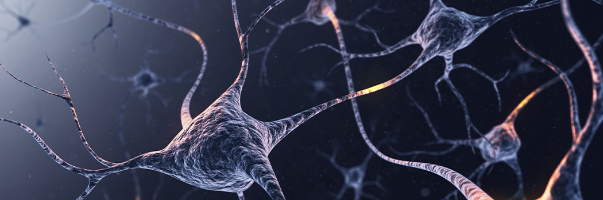

# The Pain Feeling

- **Category:** 
- **Date:** 13/04/2013
- **Author:** 
- **Source:** https://www.quranproject.org/The-Pain-Feeling-465-d

## Content

Allah, the Almighty, says:
“Surely! Those who disbelieved in Our Ayat (proofs, evidences, verses, lessons, signs, revelations, etc.) We shall burn them in Fire. As often as their skins are roasted through, We shall change them for other skins that they may taste the punishment. Truly, Allah is Ever Most Powerful, All­ Wise”
(I)
Referring to the dwellers of the Fire, Almighty Allah also says:
“… and be given, to drink, boiling water, so that it cuts up their intestines?” (II)
The Scientific Fact:
Before the age of scientific discovery, it was commonly believed that the whole human body could feel pain. It was not until the role of nerve endings in the skin were discovered, that people learned about the existence of certain nerve endings which transmit feelings of pain to the brain. The skin is associated with sensitivity because it contains the majority of nerve endings.
According to Dr. Head’s classification of the skin’s sensitivity, there are two groups of feelings:
Epictritic which senses light things, like a light touch or a slight change in temperature
Protopathic which feels pain and considerable change in temperature.
Each of these categories uses certain nerve cells in addition to other receptors for sensing any environmental change. These receptors can be categorized into four kinds:
Exteroceptors which are concerned with the faculty of sense and touch and which contain meissners and merkels corpuscles
Krause End Bulbes which are concerned with coldness
Ruffini Cylinders which are concerned with heat
Nerve Endings that can transmit any feeling of physical pain. The skin is considered the part of the body that is rich with such nerve endings that transmit heat and pain.
Anatomists have proved that people whose skin has been completely burnt cannot feel pain because their nerve endings are damaged. This is different from a person who has a second-degree burn, for he will experience severe pain as his nerve endings are not damaged, but are rather, uncovered.
Anatomists have also proved that the small intestines do not have any receptors. However, receptors can be found between the peritoneum and the outer layer of the intestines. This area contains a lot of small bodies known as pacini. The size of the peritoneum is 20,400 cubic centimetres, which makes it equal to the size of the outer layer of the skin. Also, the receptors of the intestines are similar to those in the skin.
Facets of Scientific Inimitability:
Almighty Allah explains to us in the first verse that the skin is the part of the body that will receive the punishment, i.e. there is a connection between the skin and the sensation of pain. The verse also tells us that when the skin is burnt (i.e. in the Fire), man can no longer feel the pain of the punishment and so his burnt skin is replaced with new fresh skin where the nerve endings are functioning properly and can transmit the feeling of pain. In this way, a disbeliever will suffer due to his denial of Allah’s signs. Modern science has shown us that the majority of nerve endings are found in the skin. Prior to the invention of microscopes and the progress made in the field of anatomy, no human being could have any knowledge about this scientific fact related by the Ever-Glorious Qur'an fourteen centuries ago. This is a miracle and a great sign of Allah.
The Qur'an threatens the disbelievers in the second verse that their intestines will be severed. The secret behind this threat has been solved only recently when scientists discovered that the intestines are not affected by heat. However, if they are severed, the boiling water will flow out to the place between the peritoneum and the outer layer of the intestines. This place contains a lot of nerve endings that transmit the feeling of pain to the brain and thus man will experience severe pain.
These facts show the miraculous scientific nature of the Ever-Glorious Qur'an which related these facts to mankind a long time before modern science was able to give any information about them.
(I):
Surah An-Nisa’: V 56
(II):
Surah Muhammad: V 15
Source: International Commission on Scientific Signs in the Qur'an and the Sunnah [External/non-QP]