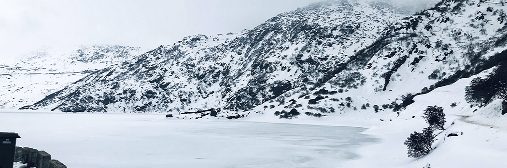

# The Polar Vortex

- **Category:** 
- **Date:** 16/02/2014
- **Author:** 
- **Source:** https://www.quranproject.org/The-Polar-Vortex-571-d

## Content

"The great Syrian scholar Abu Sulayman ad-Darani once said: "I walk out of my home, and my eyesight doesn't fall on anything around me except that I see in it either a blessing from Allah or a warning from Him."
In an edition of the Time magazine it briefly highlights one such sign. The heading reads 'The Big Chill - The polar vortex left its mark, from the Great Plains to the Atlantic.' Various photographs taken during the spell of extreme cold are displayed. Across the bottom of the two-page spread, there is a section titled 'No Escaping the Cold' which is accompanied by some facts and figures.
Here are a few:
'6,804: Number of flights to or from U.S. airports canceled Jan. 6-7... stranding thousands of passengers.'
'12: Approximate number of hours hundreds of passengers were stranded on three Amtrak trains stuck in a Western Illinois snowdrift.'
'An inmate who escaped from a Kentucky prison wearing only a thin jacket and khaki pants turned himself in Jan. 6 rather than brave the frigid temperatures.'
'Minneapolis was a balmy -20 degrees F on Jan. 7, compared with Lake Crane, Minn., where temperatures dropped to -35 degrees F, making it colder than the South Pole.'
'Hell froze over - literally. A small Michigan town called Hell experienced temperatures as low as 3 degrees F on Jan. 6.'
Explanation
Meteorologists have explained the polar vortex phenomenon. But their perspective is a limited one, as Yusuf bin Asbat said: "This world was not created for us just to look at it. Rather, it was created for us to use it to look towards the Hereafter." In other words, there is more to understanding what is going on around us than what is currently tangible. There is something deeper behind the signs in nature.
The mention of the town of Hell is fitting because one of the features of the real Hell is that it indeed contains areas of extreme cold. This may seem counterintuitive, but in an authentic hadith collected by al-Bukhari, Muslim, Ahmad and others, the Messenger of Allah (peace be upon him) said: "
Hell complained to its Lord. It said: "My Lord! Parts of me have consumed the other parts." He therefore allowed it two ventilating breaths:
one breath in the winter, and one in the summer.
So, the extreme heat you experience is from the scorching heat of Hell, and the extreme cold you experience is from the bitter cold of Hell."
Commenting on this hadith in the book 'Lata'if al-Ma'arif' (p. 318), the great Iraqi scholar Ibn Rajab al-Hambali said: "There is no doubt that Allah created for His slaves two realms in which He will pay us back for our deeds. These realms are eternal, and we never die in them. He also created an immediate, temporal realm in which those deeds are to be performed. In this realm, we live and die. He tests us in this realm with certain commands and prohibitions. He has also tasked us with believing in things which we cannot see, including the fact that we will be recompensed for our actions, as well as to believe in the two realms He created for this purpose. He has revealed Scripture and sent Messengers, and provided clear proof for the existence of the Unseen which He has commanded us to believe in. He has provided signs which prove the existence of the two realms of recompense. One is of pure pleasure, unblemished by pain. The other is of pure punishment, utterly devoid of comfort.
As for this temporary realm in which we currently reside, it is a mix of pleasure and pain. Its pleasure reminds us of the pleasure in Paradise. Its pain reminds us of the pain in Hell. We are reminded of the unseen, delayed, eternal realms through certain things Allah has placed in this realm. For example, certain times and places remind us of Paradise. As for places, Allah has created some regions of Earth - like the lands of ash-Sham (may Allah unite its Mujahidin and hasten their victory) and others - such that they contain foods, beverages, clothing, and other worldly delights which remind us of the pleasures of Paradise. As for times, the pleasant aromas of spring remind you of the pleasures and aromas of Paradise. Also, the coolness you experience in the dawn hours reminds you of the coolness of Paradise."
He continued: "And some things remind you of Hell, as Allah has placed many things in this world to remind us of the Fire which has been prepared for those who rebel against Him. You are reminded of its pain and punishment through various places, times, physical objects, and so on. As for places, there are numerous locations on Earth which are known for their extreme heat and cold. Their extreme cold reminds us of Hell's extreme cold, and their extreme heat reminds us of Hell's heat and scorching wind."
As for times, the cold is experienced primarily during the winter season, as Ibn Rajab said: "And from the virtues of winter is that it reminds us of the bitter cold in Hell, and forces us to seek Allah's protection from it."
He then lists some documented details describing Hell's bitter cold:
Ibn 'Abbas said: "The inhabitants of Hell will beg to be rescued from its heat, and they will be answered with a wind which is so cold that it will cause their bones to break. They will then ask to return to the heat."
Mujahid said: "They will flee to the bitter cold of Hell. When they fall into it, it will cause their bones to crumble such that the sounds of crunching will be audible."
Ka'b al-Ahbar said: "In Hell, there is a bitter cold known as az-Zamharir. It will cause their flesh to fall off to the point that they will beg for the heat of Hell."
'Abd al-Malik bin 'Umayr said: "It has reached me that the inhabitants of Hell will ask its gatekeeper to move them to a different region of it (due to the intensity of the heat). When they are moved, they will find a cold so severe that they will ask to be returned to their original location."
Ibn 'Abbas, describing the 'ghassaq' (mentioned in 38:57 and 78:25), said: "It is the cold which is so bitter that it burns."
Mujahid said, describing the same: "The ghassaq is so cold that they are unable to taste it."
Ibn Rajab concluded: "May Allah protect us from Hell through His grace and generosity. O you who hears these descriptions of Hell, and feels its painful breath each year, while you knowingly insist on doing what will pull you into it! You will realize who will be regretful when you see it dragged forth by seventy thousand reins! Are you able to patiently withstand its extreme heat and cold? Speak only if you want what is in your best interests, and Allah knows best.
How often does the winter arrive, then spring * The summer departs, and autumn arrives?
Transiting from heat to cold * With the sword of ruin raised over you?
O you who are in this world for but a brief stay * How often has your procrastination deluded you?
O you who chases what will eventually perish * Until when will your heart remain infatuated by it?
I am amazed at a man who lowers himself for this world * When a loaf of bread each day suffices him..."
The author concluded this section of his book with the poetry above. However, there is one more matter to address in this article:
The early Muslims would reflect on the signs embedded in nature and use them to strengthen their worship of Allah, as Wahb bin Munabbih said: "No man reflects for a long time except that he comprehends, and he doesn't comprehend except that he knows, and he doesn't know except that he acts." And today, we see that each discovery in science and nature pulls our attention to the power of Allah, and our appreciation of that power is manifested in our submission to Him. We will one day be recompensed for our deeds. So, I wanted to conclude this article by highlighting the deeds which are especially encouraged in the winter season (which is actually how Ibn Rajab opened this section of his book):
The Prophet (peace be upon him) said:
"Winter is the season of the believer," and another narration contains the addition: "Its nights are long for him to pray in, and its days are short for him to fast in."
He also said:
"Fasting in the winter is the cold booty."
As Ibn Rajab explained, it is referred to as 'cold booty' because it is booty which is gained easily, without any fighting or effort.
Abu Hurayrah would say to his companions: "Should I not point you to the cold booty? Fasting in the winter."
Ibn Mas'ud would say, upon the start of winter: "Welcome to winter! In it, blessing descends, its nights are long for prayer, and its days are short for fasting."
al-Hasan al-Basri said: "What a wonderful time the winter is for the believer! Its nights are long for him to pray in, and its days are short for him to fast in."
'Ubayd bin 'Umayr would say, upon the start of winter: "O people of the Qur'an! Your nights are now long for your recitation, so recite. Your days are now short for your fasting, so fast."
Mu'adh wept on his deathbed, and said: "Indeed, I weep because I miss being thirsty in the midday heat (i.e. fasting in the summer), praying at night in the winter, and putting my knees next to the scholars in the circles of knowledge.""
External [non QP] -Tariq Mehanna