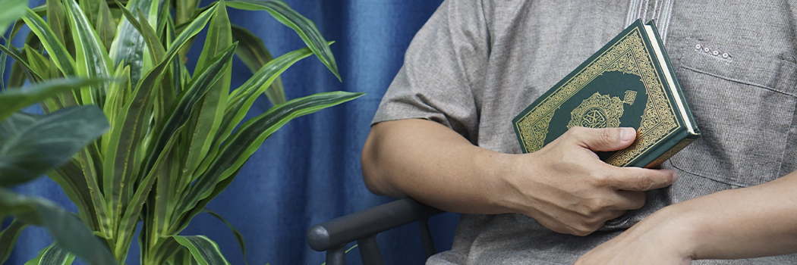

# The Qur'an & You

- **Category:** 
- **Date:** 23/01/2014
- **Author:** 
- **Source:** https://www.quranproject.org/The-Quran--You-554-d

## Content

Looking at the beginning of Surah al-Baqarah, you will notice that the very first characteristic of the Muttaqin, Allah lists is that they believe in al-Ghayb - the unseen world. Besides the obvious, there are a few practical implications of this concept in your life.  Mainly because you - O Muwahhid [person of Tawhid [monotheism] - believe what you believe not because it is popular, easy, cute and cuddly, or will get you more visits to your website. You do not draw your scale of truth and falsehood, right and wrong, acceptable and unacceptable from the reaction of the people around you.