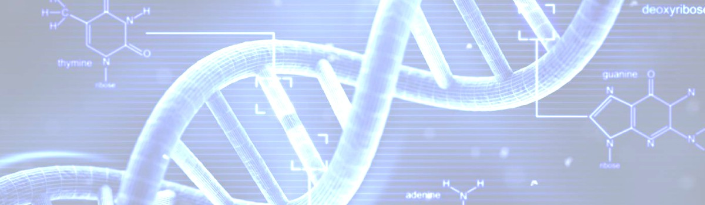

# The Qur'an on Duality in Creation

- **Category:** 
- **Date:** 08/11/2023
- **Author:** 
- **Source:** https://www.quranproject.org/The-Quran-on-Duality-in-Creation-642-d

## Content

سُبْحَانَ الَّذِي خَلَقَ الْأَزْوَاجَ كُلَّهَا مِمَّا تُنبِتُ الْأَرْضُ وَمِنْ أَنفُسِهِمْ وَمِمَّا لَا يَعْلَمُونَ
“Exalted is He who created all pairs - from what the earth grows and from themselves and from that which they do not know.” Qur’ān 36:36
This Qur’ānic verse outlines the fact that all creatures, whether living beings or solid matter, are created in pairs. It refers to everything that was created. Amazingly, the outstanding truth and generality of this and similar verses came to be gradually realised, and more so recently, during 14 centuries since the Qur’ān was first revealed in a primitive world.
DNA, deoxyribonucleic acid, carries genetic information and is a chemical made up of two long molecules, arranged in a spiral, known as the double-helix structure. Millions of animal species discovered, classified and investigated only during the last two centuries, were found to be invariably in ‘pairs,’ male and female. Electron microscopy has clarified that all living creatures, however minute, are in pairs. The smallest microbes, viruses, and bacteria have their counterpart antibodies.
Take for example DNA – it is made up of thousands of different genes, and genes are made up of base pairs. These ‘base pairs’ are made of two paired up nucleotides. In order to form a base pair, we need to pair up specific nucleotides. Each type of nucleotide has a specific shape, so only certain combinations fit.
The sequence, composition, and orientation of these ‘pairs’ of nucleotides control the genetic information carried by the DNA. A chromosome consists of different types of protein bound tightly within a single DNA molecule chain.
The DNA is a large long (up to 1 meter long) amino acid chain. It consists of a ‘pair’ of spiral strands, connected with steps.
Each step consists of a ‘pair’ of chemical components, so-called nucleotides. There are 4 nucleotides. Adenine, Thymine, Guanine and Cytosine represented respectively by the letters A,T,G and C. Due to their shapes only A and T or G and C fit into one another.
Base Pairs [A-T, G-C] (billions of these matching pairs) ---> Genes (thousands of these) --> DNA --> Chromosomes --> Nucleotides --> Nucleus (the ‘brain’ of the cell).
All life systems including plant, animal and human consist of different types of cells. A cell consists of a nucleus surrounded with cytoplasm which is usually enclosed, within a cell wall. The cell nucleus carries the chromosomes that control all the cell functions. All cells of a particular organism have exactly the same number of chromosomes; the number varies widely between different species.
Proteins are formed from various combinations of amino acids. Specifically, 20 types of amino acid are used in different combinations to form more than a million types of protein, present in a human being. Every type of amino acid can exist in either pair of structures (right-handed isomer or left-handed isomer), with opposite polarised light rotation direction. The same applies to the proteins formed thereof.
The wide variety of creatures including living species, solid matter, liquids and gases are marvellous combinations of the same list of building blocks: atoms. These basic units, were long known to consist of a ‘pair’ of a positively charged nucleus surrounded by negative electrons. The nucleus consists of protons that carry the positive charge, together with neutrons. Even the neutral neutrons have their counterpart, the anti-neutrons. Later advances in nuclear physics has demonstrated that each of these particles is, in effect, a complex structure of much smaller nuclear particles. Over 200 of such elementary particles are now known.
At the atomic level, atoms can, literally, ionise i.e. either lose or gain electrons to form positive cations or negative anions. ‘Pairs’ of cations/anions combine to produce the wide variety of chemical (inorganic) compounds. This is one of the conclusions made by British physicist Paul Dirac, winner for Nobel Prize for Physics in 1933. His finding, known as ‘parity,’ revealed the duality known as matter and antimatter.
Another example of duality in creation is plants. Botanists only discovered that there is a gender distinction in plants some 100 years ago. Yet, the fact that plants are created in pairs was revealed in the verses of the Qur’ān 1,400 years ago. It was only after the discovery of microscopes that human beings knew that plants have male organs (stamens) and female organs (ovaries) and that the wind, together with other factors, carries the pollen from one type to the opposite one so that reproduction can take place.
Every animal species of the wide animal kingdom reproduces sexually. Sexual reproduction results from the combination of a female ovum and a male sperm. The formation of this zygote ‘pair’ is the starting point in the reproduction cycle. The sperms, in turn are of ‘two’ kinds, the first carries the hereditary male characteristics, while the other carries the female ones. Flowering plants, of which more than 250,000 have been discovered so far, also reproduce sexually. They have both female (ovaries containing eggs) and male (stamens carrying pollens); either combined in the same flower or in different flowers. In the latter case, fertilization occurs when pollens are transferred by wind or insects to an adjacent flower.
Non-flowering plants, on the other hand, amounting to 150,000 species, reproduce in a double-stage cycle of sexual and asexual reproduction. Yet, the asexual reproduction stage is essentially a process of breaking up the DNA ‘pair’ of strands into two; followed by each of which re-forming its complementary strand. Thus, a new ‘pair’ of identical DNA molecules results in the cell, just before it divides into a ‘pair’ of identical cells.
The same applies to the asexual reproduction of bacteria. Each bacterium consists of a single cell, the smallest biological unit able to function independently. A single bacterium reproduces the same way explained above, i.e. by splitting into a pair of identical cells. As we have seen, cell division occurs through the process of DNA replication, in which the two strands of the DNA molecules are separated; and each strand synthesises a complementary strand to itself. So, ‘asexual’ reproduction of bacteria involves the DNA ‘pair’ of strands splitting and reformation into a new ‘pair’ of cells.
Read more here -
Scientific Truths and the Qur'an