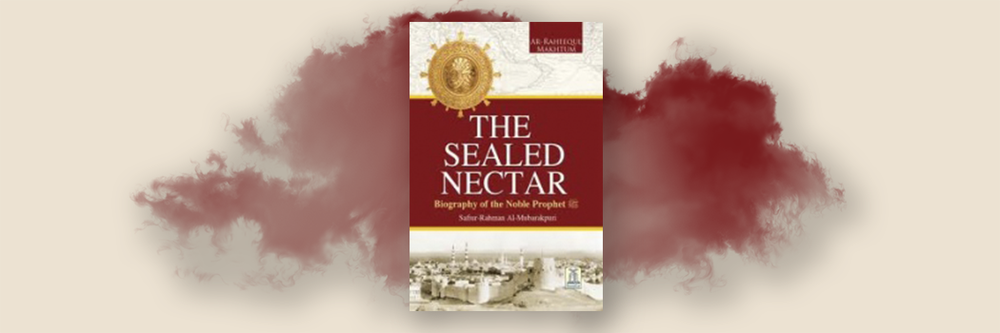

# The Sealed Nectar - ar-Raheeq al-Makhthum

- **Category:** 
- **Date:** 08/04/2013
- **Author:** BySafi-ur-Rahman al-Mubarkpuri
- **Source:** https://www.quranproject.org/The-Sealed-Nectar---ar-Raheeq-al-Makhthum-455-d

## Content

A complete authoritative book on the life of Prophet Muhammad (S) by Sheikh Safi-ur-Rahman al-Mubarkpuri. It was honored by the World Muslim League as first prize winner book. Whoever wants to know the whole life style of the Prophet in detail must read this book.
Muhammad (S) is the Messenger of Allah, and those who are with him, are severe against the disbelievers, and merciful among themselves. You see them bowing and falling down prostrate (in prayer), seeking bounty from Allah and (His) Good Pleasure. The mark of them (i.e. of their Faith) is on their faces (fore heads) from the traces of prostration (during prayers). This is their description in the Taurdt (Torah). But their description in the Injeel (Gospel) is like a (sown) seed which sends forth its shoot, then makes it strong, and becomes thick and it stands straight on its stem, delighting the sowers, that He may enrage the disbelievers with them. Allah has promised those among them who believe and do righteous good deeds, forgiveness and a mighty reward (Paradise).
(Al-Fath: 29)
The Prophet Muhammad (S) said:
"The example of guidance and knowledge with which Allah has sent me is like abundant rain falling on the earth. Some of which was fertile soil that absorbed rain-water and brought forth vegetation and grass in abundance. (And) another portion of it was hard and held the rain-water and Allah benefited the people with it and they utilized it for drinking, (making their animals drink from it) and to irrigate the land for cultivation. (And) a portion of it was barren which could neither hold the water nor bring forth vegetation (then that land gave no benefits). The first is the example of the person who comprehends Allah's Religion (Islam) and gets benefit (from the knowledge) which Allah (Azawajal) has revealed through me (the Prophet ) and learns and then teaches it to others. The (last example is that of a) person who does not care for it and does not take Allah's Guidance revealed through me (he is like that barren land)."
(Al-Mukarramah)