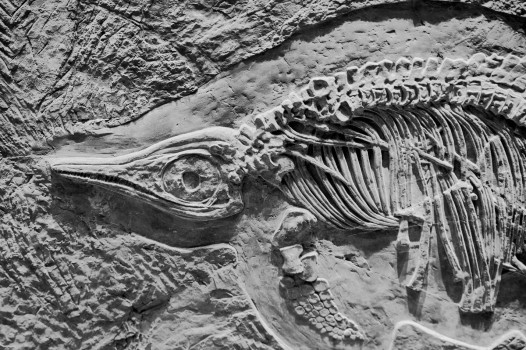

# The Silent Stones: What the Fossil Record Really Says About Evolution

- **Category:** 
- **Date:** 16/01/2026
- **Author:** ByA.B. al-Mehri
- **Source:** https://www.quranproject.org/The-Silent-Stones-What-the-Fossil-Record-Really-Says-About-Evolution-696-d

## Content

The fossil record, rather than confirming evolutionary theory's prediction of gradual transitions between species, reveals a pattern of stasis and sudden appearances of fully formed organisms, with the persistent absence of transitional forms exposing fundamental flaws in the claim that natural selection can account for the origin and diversity of life.
If the theory of
evolution is correct and accurate, then we should naturally expect to find
ample evidence in the fossil record. As animals are supposedly evolving and
"incremental physical" changes are happening, we should find
innumerable fossils demonstrating animals transitioning as they are evolving.
However, not only do we find no fossil evidence despite there being millions of
various types of animals, but we find the exact opposite: fossils of complete
and fully formed animals.
We find long periods of
stability and sudden appearances of fully formed
species
.
This phenomenon, known as "stasis," contradicts the expectation of
slow, incremental changes that the theory of evolution predicts.
"Stasis" in the fossil record refers to a pattern where species appear
to remain relatively unchanged over long periods of geological time, showing
little or no significant morphological (physical) alteration for millions of
years.
The absence of
transitional fossils, the intermediate forms between major groups of species, directly
challenges evolutionary theory. The Cambrian Explosion (541 million years ago)
is a phenomenon in the fossil record which contradicts Evolution. Stephen C.
Meyer highlights the Cambrian Explosion in his book, Darwin's Doubt: The
Explosive Origin of Animal Life and the Case for Intelligent Design, that
the fossil record prior to the Cambrian period shows little evidence of the
complex life forms that suddenly appear during this explosion.
He argues that there is
an absence of transitional forms leading to the Cambrian fauna, disproving the
idea that these species evolved gradually. According to Meyer, this sudden
burst of biological diversity is more consistent with the idea of an
Intelligent Agent introducing complex organisms than with the slow and gradual
changes posited by evolutionary theory. This rapid diversification of life
forms, often referred to as "the biological big bang," is difficult
to explain through the slow, gradual processes of natural selection. (1
)
This lack of gradual,
transitional fossils shows that evolution is not the mechanism through which
species appeared. Stephen Jay Gould, the renowned palaeontologist at Harvard
University and one of the most influential evolutionary biologists of the 20th
century, admits,
"The extreme rarity of transitional forms in the
fossil record persists as the trade secret of palaeontology. The evolutionary
trees that adorn our textbooks have data only at the tips and nodes of their
branches; the rest is inference, however reasonable, not the evidence of fossils."
(2)
In fact, Charles Darwin
acknowledged this problem himself, calling the lack of transitional fossils in
the record
"the gravest objection which can be urged against my
theory."
(3)
He admitted that the incomplete nature of the fossil record
made it difficult to demonstrate the slow, incremental changes his theory
proposed. It has been over 140 years since his death, and yet the fundamental
problem remains: the fossil record still does not display the countless
transitional forms that Darwin himself expected.
Instead of revealing a
gradual, continuous chain of life, the evidence shows sudden appearances and
fully formed species. Despite decades of searching, the predicted "
missing links
"
remain elusive, leaving this core weakness unresolved and casting major doubt
on the claim that evolution can account for the origin and diversity of life.
An objective and
thorough study of nature reveals serious gaps, unanswered questions, and
inconsistencies that expose the irrational and illogical basis of such claims. To
illustrate this, let us pose a few simple yet rational questions using the
example of the elephant.
Evolutionary biologists
claim that modern elephants evolved from a group of extinct mammals known as
proboscideans. (4
) The earliest ancestor of elephants is believed to be a small,
semi-aquatic mammal called Moeritherium, which lived around 37 million years
ago. Moeritherium is allegedly smaller than modern elephants, and it resembled
a hippopotamus with
no long trunk and short legs
. Over time, the
descendants of Moeritherium are gradually meant to have evolved larger body
sizes, tusks, and trunks, adapting to changing environmental conditions. (5)
The following is the
hypothetical and alleged timeline for the animal with no trunk to evolve to an
elephant with a trunk spanning tens of millions of years:
1. Moeritherium
(37 million years ago): This early ancestor,
which lived during the late Eocene epoch, had no trunk. Moeritherium was a
small, semi-aquatic mammal, more like a tapir or hippo, with a short snout, and
it did not yet have the distinctive long trunk we associate with modern
elephants.
2. Palaeomastodon
(30 million years ago): About 7 million years
later, during the Oligocene epoch, the Palaeomastodon evolved with a slightly
longer snout. It was not a full trunk, but it was a precursor to it. This early
stage shows the gradual elongation of the face and nose.
3. Gomphotheres
(20-10 million years ago): By the Miocene
epoch, species like the Gomphotheres began to evolve a more recognisable trunk.
This period marked a significant transition in the development of the trunk and
tusks. Gomphotheres had a longer trunk.
4. Modern Elephants
(5 million years ago to
present): The fully developed trunk as we see it today in modern elephants
(African and Asian species) likely emerged by the late Miocene or early
Pliocene (around 5 million years ago). The trunk became a versatile organ used
for feeding, drinking, social interaction, and more. (6)
"Missing
Links" - Fake Fossils and Anthropology's Greatest Hoax
During the 20th century,
several fossil discoveries - once celebrated as the definitive
"proof" of human evolution - were later proven to be hoaxes,
fabricated specimens that deceived both the scientific community and the public
for decades. These forgeries were presented as conclusive evidence of
"missing links" in the fossil record, showing transitional forms
between major groups such as fish and amphibians, reptiles and birds, and apes
and humans. These forgeries had a catastrophic impact on scientific thought, misleading
researchers for nearly forty years and shaping evolutionary reconstructions -
though all were later shown to be fakes. Two notable examples:
Piltdown Man
(Eoanthropus dawsoni) - The Most Famous Hoax.
Discovered by Charles Dawson in 1912 in Sussex, England. Was hailed as the
"missing link" between ape and man, with a human-like skull and an
ape-like jaw. In 1953, it was exposed as a fraud using advanced testing; it was
revealed that the skull was a composite: the cranium of a modern human and the
jaw of an orangutan, with filed-down teeth stained to appear ancient. (7)
Nebraska Man
(Hesperopithecus haroldcookii) - A Tooth Becomes
a "Man." Discovered in 1917 in Nebraska, USA, by Harold Cook. A
single tooth was used to reconstruct an entire primitive human ancestor, dubbed
"Nebraska Man." By 1927, the tooth was proven to belong not to a
human, but to a pig. "Nebraska Man" became a textbook example of
scientific error and overinterpretation based on scant evidence.
The fossil record contradicts evolutionary predictions. Instead of countless transitional forms, we find sudden appearances of fully formed organisms, long periods of stasis, and persistent gaps between species. The Cambrian Explosion and the absence of intermediate fossils expose a fundamental weakness in Darwin's theory. The evidence points not to gradual, blind processes, but to deliberate design by an intelligent Creator.
(Taken
from the book: ‘
God: There is No Doubt!’)
Footnotes
(1)
Stephen Meyer,
Darwin’s Doubt: The Explosive Origin of Animal Life and the Case for Intelligent Design
. HarperOne
(2) Stephen Jay Gould,
The Extreme Rarity of Transitional Forms in the Fossil Record Persists as the Trade Secret of Paleontology.
Natural History
(3) Charles Darwin, On the Origin of Species
(4) Jeheskel Shoshani and Pascal Tassy,
Advances in proboscidean taxonomy & classification, anatomy & physiology, and ecology & behaviour
(5) Jeheskel Shoshani and Pascal Tassy (editors),
The Proboscidea: Evolution and Palaeoecology of Elephants and Their Relatives
. Oxford University Press, p. 334.
(6) Ibid., p. 354.
(7) Reference: The official scientific paper that exposed the hoax was Weiner, J. S., Oakley, K. P., & Le Gros Clark, W. E. (1953).
The Solution of the Piltdown Problem
. Bulletin of the British Museum (Natural History). Also refer to Spencer, F.,
Piltdown: A Scientific Forgery
(Oxford University Press) - a detailed scholarly look at how and why the fraud succeeded for decades.