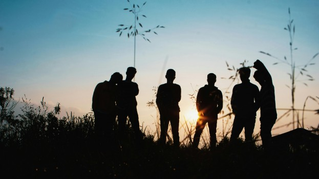

# The Social Consequences of Atheism

- **Category:** 
- **Date:** 23/01/2026
- **Author:** ByA.B. al-Mehri
- **Source:** https://www.quranproject.org/The-Social-Consequences-of-Atheism-716-d

## Content

Statistical evidence from Western societies demonstrates a direct correlation between declining belief in God and the rise of moral decay, as evidenced by dramatic increases in adultery, abortion, divorce, mental illness, and suicide - revealing that when Divine accountability is removed, human societies inevitably descend into nihilism and moral chaos.
There is a direct correlation between a
society’s decline in
belief in God
and the rise of immorality within it. As
societies become more secular and irreligious, moral decay always takes root.
Official census data from many Western countries, including the USA, the UK and
Germany, show that the proportion of people identifying as having “no religion”
has increased dramatically - reflecting the growth of atheism. At the same
time, these societies have witnessed massive rises in adultery, abortions,
divorces, mental illness, and suicide. When people no longer believe in God,
nor fear accountability for their actions, life becomes nihilistic - void of
purpose and real direction - and easily descends into a hedonistic rabbit hole.
Adultery
The epidemic rise of zina (adultery) has become
one of the clearest indicators of moral decline in secular societies. In 2014,
Pew Research reported that in the United States, only around 5% of all births
in 1960 were to unmarried mothers. By 2000, that figure had risen to 33%, and
since 2008, it has hovered around 41%. (1) Similar patterns are seen across much of
the Western world, where the weakening of belief in God has coincided with the
erosion of the family structure. What was once viewed as shameful or sinful is
now normalised. The social cost has been immense: the breakdown stable
families, the psychological harm suffered by children born into fractured
homes, and the collapse of moral boundaries. When belief in God fades, and
Divine accountability is replaced by self-gratification, human relationships
lose their sanctity. Marriage becomes disposable, fidelity optional, and
modesty obsolete.
Abortions
Adultery and fornication also produce an
inevitable consequence - the conception of babies. In a morally confused world,
these lives are not treated as blessings, but as burdens, disposable
inconveniences. Since the 1960s, it is estimated that more than one billion
abortions have taken place worldwide (2) - a staggering figure that reflects a
global moral crisis. In the year of 2022 alone, there were 251,377 abortions in
the United Kingdom (3) and 613,383 in the United States. (4) Each of these numbers
represents not just a statistic, but a human life: in essence, a degraded form
of murder - the taking of life at its most vulnerable stage.
What was once unthinkable has become routine.
The sanctity of motherhood has been replaced by convenience, and the womb, once
the safest place for a child, has become one of the most dangerous. The
normalisation of abortion is sign of how far a society can drift when moral
truth is severed from belief in God.
If we extend our examination on murder rates and
suicide, the same pattern emerges over the past hundred years: as people drift
further from God, moral decay deepens. The more secular people become, the less
sacred life itself appears. Could anyone, even fifty years ago, have imagined
the scale of moral corruption we witness today? The proliferation of
pornography, for instance, has reached epidemic proportions - poisoning minds,
degrading women, destroying families, and dehumanising entire generations.
For the atheist, there is no God, no ultimate
accountability - only the cold logic of “survival of the fittest.” In such a
mindset, evil becomes relative and conscience a social construct. Prominent
atheist thinkers like Sam Harris have even said,
“If I could wave a magic wand
and get rid of either rape or religion, I would not hesitate to get rid of
religion.”
(5) This statement reveals the intellectual blindness of godlessness,
where the very moral foundation that condemns evil is itself despised and when
a person rejects God, he inevitably loses the ability to distinguish between
good and evil.
God as the Moral Anchor
The evidence is overwhelming, and the verdict is
clear. From the wreckage of atheistic regimes to the moral disintegration of
secular societies, the pattern keeps repeating - where God is denied,
destruction follows. When belief in God is abandoned, humanity loses the
compass that gives life meaning, morality, and dignity. History stands as a
witness that when people attempted to replace God with human reasoning alone,
the result was not liberation, but tyranny. Ideologies that sought to build a
world without God ended up devaluing life itself. Civilisations rise and fall
on this one truth: a people who forget God ultimately lose the very qualities
that make them human.
Conclusion
Our hope lies not in rejecting God, but in
returning to Him. To restore moral order, we must first restore Iman (faith).
God is the necessary foundation of truth, meaning, and existence itself. The
person that recognises Him finds clarity amidst confusion and purpose amidst
chaos. For in the end, every heart that seeks truth discovers the same
undeniable reality: God exists and there is no doubt!
(Taken from the book:
‘God: There is
No Doubt!’
)
Footnotes
(1)  https://www.pewresearch.org/short-reads/2014/08/13/birth-rate-for-unmarried-women-declining-for-first-time-in-decades
(2)  Thomas W. Jacobson and William Robert Johnston, “Abortion Worldwide Report,” The Global Life Campaign, 2017, https://www.globallifecampaign.com/abortion-worldwide-report and William Robert Johnston, “Chart Summary of Reported Abortions Worldwide Through August, 2015,” http://www.johnstonsarchive.net/policy/abortion/wrjp3314.html.
(3)  https://www.theguardian.com/world/article/2024/may/24/number-abortions-england-wales-record-levels
(4)  https://www.cdc.gov/mmwr/volumes/73/ss/ss7307a1.htm
(5)  https://www.thesunmagazine.org/articles/22970-the-temple-of-reason?