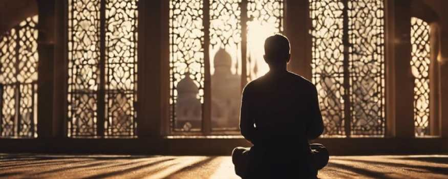

# The Transformative Power of Dhikr: Remembrance of God in Islam

- **Category:** 
- **Date:** 02/02/2025
- **Author:** 
- **Source:** https://www.quranproject.org/The-Transformative-Power-of-Dhikr-Remembrance-of-God-in-Islam-675-d

## Content

Dhikr, the remembrance of Allah, holds a unique and transformative role in the life of a Muslim. Its impact extends beyond ritual acts, deeply influencing the believer's spiritual, emotional, and physical well-being while fostering an intimate connection with the Creator. This profound practice encompasses countless benefits that shape the heart and soul.
One of the foremost effects of Dhikr is its ability to repel and break the influence of Shaytan. The heart that is engaged in the remembrance of Allah becomes fortified, rendering it resistant to the whispers of the devil. At the same time, Dhikr brings immense pleasure to Allah, the Most Merciful, as it reflects the servant's devotion and gratitude.
The practice of Dhikr soothes the heart, removing its burdens and replacing them with serenity and joy. It has a remarkable capacity to dissolve the cares and worries that weigh on the soul, offering a sense of comfort that cannot be matched by worldly means. Moreover, it strengthens both the heart and body, providing spiritual resilience and physical vitality.
One of the greatest gifts of Dhikr is its ability to instill love for Allah in the heart of the believer. This love is the essence of Islam and the foundation of a meaningful relationship with the Creator. Consistency in Dhikr opens the doors to this love, making it the path to ultimate spiritual fulfillment. Alongside this, Dhikr fosters a state of vigilance, or muraqabah, which leads the servant to worship Allah with the awareness of His presence, a level of devotion known as ihsan.
Through Dhikr, a believer is naturally inclined to turn back to Allah in every state, fostering a sense of reliance and proximity to the Divine. The closeness a person achieves with Allah is directly proportional to the frequency and sincerity of their remembrance. In contrast, heedlessness creates distance from the Creator.
The remembrance of Allah also brings about Allah’s remembrance of the servant. This mutual relationship is beautifully articulated in the Qur'an:
"Remember Me, and I will remember you."
Such divine attention endows the heart with life, much like water sustains a fish. Without Dhikr, the heart becomes desolate, detached from its purpose and source of sustenance.
The act of Dhikr polishes the heart, erasing sins and protecting the believer from falling into further transgressions. It removes the estrangement that may exist between a servant and their Lord, fostering a deep and intimate connection. Words of remembrance ascend to the Throne of Allah, creating a spiritual bond that transcends worldly limitations.
Dhikr also ensures that when a believer remembers Allah in times of ease, Allah will be with them in times of adversity. This practice is a shield against divine punishment, offering a sense of tranquility and security in both this life and the Hereafter. On the Day of Judgment, Dhikr and tears shed in reverence to Allah will provide shade and protection.
Among all forms of worship, Dhikr is the easiest to perform, as it requires no physical exertion—only the movement of the tongue. Despite its simplicity, it yields immense rewards, including the planting of trees in Paradise. Consistent remembrance keeps the believer mindful of Allah, protecting them from the forgetfulness that leads to spiritual misery in this world and the next.
Ibn Taymiyyah compared Dhikr to a heaven on earth, emphasizing that those who fail to enter this spiritual sanctuary will not experience the ultimate joy of Paradise in the Hereafter. This practice illuminates the heart with divine light, proportional to the intensity of one’s remembrance.
The intimacy developed through Dhikr is unparalleled. Allah promises His presence to those who remember Him, as described in the hadith:
"I am with My slave when he remembers Me and when his lips move to mention Me."
This closeness forms the foundation of gratitude, as abundant remembrance naturally leads to abundant thanks. Moreover, it becomes the basis of friendship with Allah, as a servant who persists in Dhikr is drawn into divine love.
Dhikr attracts Allah’s blessings and repels His wrath, acting as a source of divine protection. The strength of this protection is tied to the strength of one’s faith, which is directly enhanced by remembrance. It is through Allah’s remembrance of His servant that the inspiration to engage in Dhikr arises, creating a reciprocal relationship of divine mercy and human devotion.
Ultimately, those who excel in any form of worship—be it fasting, Hajj, or other acts—are distinguished by the extent of their remembrance of Allah. Dhikr elevates every action, imbuing it with sincerity and divine favor. It is the lifeline of the believer, the essence of faith, and the pathway to ultimate success in this world and the Hereafter.