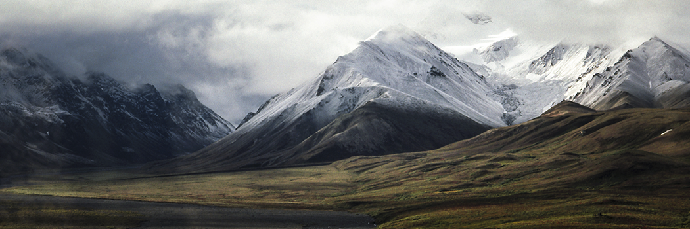

# The mountains as stabilizers for the earth..

- **Category:** 
- **Date:** 20/04/2013
- **Author:** 
- **Source:** https://www.quranproject.org/The-mountains-as-stabilizers-for-the-earth-472-d

## Content

"And the mountains He has fixed firmly, (To be) a provision and benefit for you and your cattle." (I)
In these two Qur’anic verses it is explicitly stated that the stabilization of the Earth by means of its mountains was a specific stage in the long process of creation of our planet and still is a very important phenomenon in making that planet suitable for living. Now, the following question arises: how can modern Earth Scientists visualize mountains as means of fixation for the Earth?
As mentioned above, the rocky outer cover of the Earth (the lithosphere, which is 65-70 km thick under oceans and 100-150 km thick under continents) is broken up by deep rift systems into separate plates (major, lesser and minor plates as well as micro plates, plate fragments and plate remains). Each of these rigid, outer, rocky covers of the Earth floats on the semi-molten, plastic outermost zone of the Earth’s Mantle (the asthenosphere) and move freely away from, past or towards adjacent plates.
At the diverging boundary of each plate, molten magma rises and solidifies to form strips of new ocean floor, and at the opposite boundary (the converging boundary) the plate dives underneath the adjacent plate ‘(subducts) to be gradually consumed in the underlying uppermost mantle zone (the asthenosphere) at exactly the same rate of sea-floor spreading on the opposite boundary. An ideal rectangular, lithospheric plate would thus have one edge growing at a mid-oceanic rift zone (diverging boundary), the opposite edge being consumed into he asthenosphere of the over­riding plate (converging or subduction boundary) and the other two edges sliding past the edges of adjacent plates along transform faults (transcurrent or transform fault boundaries, sliding or gliding boundaries).
In this way, the lithospheric plates are constantly shifting around the Earth, despite their rigidity, and as they are carrying continents with them, such continents are also constantly drifting away or towards each other. As a plate is forced under another plate and gets gradually consumed by melting, magmatic activity is set into action. More viscous magmas are intruded, while lighter and more fluid ones are extruded to form island arcs that eventually grow into continents, are plastered to the margins of nearby continents or are squeezed between two colliding continents. Traces of what is believed to have been former island-arcs are now detected along the margins and in the interiors of many of today’s continents (e.g. the Arabian Shield).
The divergence and convergence of lithospheric plates are not confined to ocean basins, but are also active within continents and along their margins. This can be demonstrated, by both the Red Sea and the Gulf of California troughs which are extensions of oceanic rifts and are currently widening at the rate of 3cm/year in the former case and 6 cm/year in the latter. Again the collision of the Indian Plate with the Eurasian Plate (which is a valid example of continent/continent collision) has resulted in the formation of the Himalayan Chain, with the highest peaks currently found on the surface of the Earth.
Earthquakes are common at all plates’ boundaries, but are most abundant and most destructive along the collisional ones. Throughout the length of the divergent plate boundary, earthquakes are shallow seated, but along the subduction zones, these come from shallow, intermediate and deep foci (down to a depth of 700 kin), accompanying the downward movement of the subducting plate below the over-riding one. Seismic events also take place at the plane’s transcurrent fault boundaries where ii slides past the adjacent plates along transform faults.
Plate movements along fault planes do not occur continuously, but in interrupted, sudden jerks, which release accumulated strain. Moreover, it has to be mentioned that lithospheric plates do not all travel at the same speed, but this varies from one case to another. Where the plates are rapidly diverging, the extruding lava in the plane of divergence spreads out over a wide expanse of the ocean bottom and heaps up to form a broad mid-oceanic ridge, with gradually sloping sides (e.g. the East Pacific Rise).
Contrary to this, slow divergence of plates gives time for the erupting lava flows to accumulate in much higher heaps, with steep crests (e.g. the Mid-Atlantic Ridge). The rates of plate movements away from their respective spreading centers can be easily calculated by measuring the distances of each pair of magnetic anomaly strips on both sides of the plane of spreading. Such strips can be easily identified and dated, the distance of each from its spreading center can be measured, and hence the average spreading rate can be calculated .Spreading rates at mid-oceanic ridges are usually given as half-rates, while plate velocities at trenches are full rates. This is simply because the rate at which one lithospheric plate moves away from its spreading center represents half the movement at that center as the full spreading rate is the velocity differential between the two diverging plates which were separated at the spreading center (the mid-oceanic ridge).
In studying the pattern of motion of plates and plate boundaries, nothing is fixed, as all velocities are relative. Spreading rates vary from about 1 cm/year in the Arctic Ocean, to about 18cm/year in the Pacific Ocean, with the average being 4-5 cm/year. Apparently, the Pacific Ocean is now spreading almost ten times faster than the Atlantic (C.f. Dott and Batten, 1988). Rates of convergence between plates at oceanic trenches and mountain belts can be computed by vector addition of known plate rotations (C.f. Le Pichon, 1968). These can be as high as 9 cm/year at oceanic trenches and 6 cm/year along mountain belts (Le Pichon, op. c.i.t) Rates of slip along the transform fault boundaries of the lithospheric plate can also be calculated, once the rates of plate rotation are known.
The patterns of magnetic anomaly strips and sediment thickness suggest that spreading patterns and velocities have been different in the past, and that activity along mid-oceanic ridges varies in both time and space. Consequently such ridges appear, migrate and disappear. Spreading from the Mid-Atlantic rift zone began between 200 and 150 MYBP, from the northwestern Indian Ocean rift zone between 100 and 80 MYBP, while both Australia and Antarctica did not separate until 65 MYBP (cf. Dott and Batten, bc. cit.). Volcanoes also abound at divergent boundaries, whether under the sea or on land. Most of these volcanoes have been active for a period of 20-30 million years or even more (e.g. the Canary Islands).
During such long periods of activity, older volcanoes were gradually carried away from the spreading zone and its constantly renewed plate edge, until they became out of reach of the magma body that used to feed them and hence gradually faded out and died. The floor of the present-day Pacific Ocean is spudded with a large number of submerged, non-eruptive volcanic cones (guyots) that are believed to have come into being by a similar process. Continental orogenic belts are the result of plate boundary interaction, which reaches its climax when two continents come into collision, after consuming the ocean floor that used to separate them. Such continent/continent collision results in the scraping off of all sediments and sedimentary rocks, as well as volcanic rocks that have accumulated on the ocean floor and in the oceanic trenches and squeezing them between the two colliding continents.
This results in considerable crumpling of the margins of the two continents, followed by the cessation of plate movement at the junction. The two continental plates become welded together, with considerable crystal shortening (in the form of giant thrusts and infrastructural nappes) and considerable crystal thickening (in the form of the decoupling of the two lithospheric plates as well as their penetration by the deep downward extensions of the mountainous chains then formed). Such downward extensions of the mountains are commonly known as mountain roots” and are several times their protrusion above the ground surface. Such deep roots stabilize the continental masses (or plates), as plate motions are almost completely halted by their formation, especially when the mountain mass is entrapped within a continent as an old craton.
Again, the notion of a plastic layer (asthenosphere) directly below the outer rocky cover of the Earth (lithosphere) makes it possible to understand why the continents are elevated above the oceanic basins, why the crust beneath them is much thicker (30-40 kin) than it is beneath the oceans (5-8 kin) and why the thickness of the continental plates (100-150 kin) is much greater than that of the oceanic plates (65-70 kin).
This is simply because of the fact that the less dense lithosphere (about 2.7 to 2.9 gm/cm3) is believed to float on top of the denser, and more easily deformed, plastic asthenosphere (> 3.5 gm 1cm3), in exactly the same way an iceberg floats in the oceanic waters. Inasmuch as mountains have very deep roots, all other elevated regions such as plateaus and continents must have corresponding (although much shallower) roots, extending downward into the asthenosphere. In other words, the entire lithosphere is floating above the plastic or semi plastic asthenosphere, and its elevated structures are held steadily by their downwardly plunging roots .Lithospheric plates move about along the surface of the Earth in response to the way in which heat flows arrive at the base of the lithosphere, aided by the rotation of the Earth around its own axis.
There is enough geologic evidence to support the fact that both processes have been much more active in the distant geologic past, slowing gradually with time. Consequently, it is believed that plate movements have operated much more rapidly in the early stages of the creation of the Earth and have been steadily slowing down with the steady building-up of mountains and the accretion of continents. This slowing down of plate movements may also have been aided by a steady slowing down in the Earth’s rotation around its own axis (due to the operating influence of tides which is attributed to the gravitational pull of both the sun and the moon) and also by a steady decrease in the amount of heat arriving from the interior of the Earth to its surface as a result of the continued consumption of the source of such heat flows which is believed to be the decay of radioactive materials.
The above mentioned discussion clearly indicates that one of the basic functions of mountains is its role in stabilizing continental masses lest these would shake and jerk, making life virtually impossible on the surface of such continents) The precedence of the Glorious Qur’an with more than 14 centuries in describing this phenomenon is a clear testimony for the fact that this Noble Book is the word of the Creator in its divine purity and that Muhammad (pbuh) is His final Messenger.
In an authentic saying, the noble Prophet is quoted to have said that: “When Allah created the Earth it started to shake and jerk, then Allah stabilized it by the mountains”. This unlettered Prophet lived at a time between 570 and 632 A.C. When no other man was aware of such facts, which only started to unfold by the beginning of the twentieth century, and was not finally formulated until towards its very end. The above mentioned four examples of Qur’anic verses include the basic foundations of the most recently established concept in Earth Sciences, namely “the concept of Plate Tectonics”.
This concept was only formulated in the late sixties and the early seventies of this century (cf. McKenzie 1967; Maxwell and others, 1970; etc.), i.e. about 1335 years after the time of Prophet Muhammad (pbuh) the concept is based on the following observed facts:
That the outer rocky layer of the Earth is deeply faulted, and this is explicitly mentioned in the Qur’anic verse:
"And the earth which splits (with the growth of trees and plants)."
(II)
That hot lava flows pour out from such deep faults, particularly in the middle parts of certain seas and oceans, and this is clearly implied in the Qur’anic verse:
"And the sea kept filled (or it will be fire kindled on the Day of Resurrection)."
(III)
That the flow of such lavas can cause the surface of the Earth to shake and jerk, can lead to the movement of these faulted blocks and the formation of trenches in which deep roots of the mountains are formed. This is implied by both the verses:
"And the earth which splits (with the growth of trees and plants)"
(IV) and
"And the mountains as pegs"
(V)
That these. sudden jerky movements of the continental plates are halted by the formation of mountains and this is clearly emphasized in the verse:
"And the mountains He has fixed firmly”
(I)
As well as in many other Qur’anic verses including:
"And it is He Who spread out the earth, and placed therein firm mountains and rivers and of every kind of fruits He made Zawjain Ithnain (two in pairs-may mean two kinds or it may mean: of two varieties, e.g. black and white, sweet and sour, small and big).He brings the night as a cover over the day. Verily, in these things, there are Ayat (proofs, evidences, lessons, signs, etc.) for people who reflect" (VI)
"And the earth We have spread out, and have placed therein firm mountains, and caused to grow therein all kinds of things in due proportion." (VI:A)
and
"And We have placed on the earth firm mountains, lest it should shake with them, and We placed therein broad highways for them to pass through, that they may be guided." (VII)
and
"Is not He (better than your gods) Who has made the earth as a fixed abode, and has placed rivers in its midst, and has placed firm mountains therein, and has set a barrier between the two seas (of salt and sweet water)? Is there any ilah (god) with Allah? Nay, but most of them know not!" (VIII)
"And have placed therein firm, and tall mountains, and have given you to drink sweet water?" (IX)
and
"And the mountains He has fixed firmly." (X)
These facts about our planet started to unfold only in the middle of the nineteenth century, more than 12 centuries after the revelation of the Glorious Qur’an, when George Airy (1865) came to realize that the excess mass of the mountains above sea-level is compensated by a deficiency of mass in the form of underlying roots which provide the buoyant support for the mountains. Airy (Op... cit) proposed that the enormously heavy mountains are not supported by a strong rigid crust below, but that they “float” in a “sea” of dense rocks. In such a plastic, non-rigid “sea” of dense rocks, high mountains are buoyed up at depth in more or less the same way an iceberg is hydrostatically buoyed up by water displaced by the great mass of ice below the water surface.
In this manner, a mountain range is isostatic in relation to the surrounding portions of the Earth’s Crust, or in other words, mountains are merely the tops of great masses of rocks mostly hidden below the ground surface, and floating in a more dense substratum as icebergs float in water. A mountainous mass with an average specific gravity of 2.7 (that of granite) can float into a layer of plastic sematic rock (with a specific gravity of 3.0) with a “root” of about 9/10, and a protrusion of 1/10 its total length. This ratio of mountain root to its outward elevation can sometimes go up to 15:1, depending on the difference in the average densities of both the mountain s rock composition and of the material in which its root is immersed.
Such observations have led to the concept of isostasy (Dutton, 1889) and have introduced the principles of gravity surveying. Again, both seismic and gravitational evidences have clearly indicated that the Earth’s crust is thickest under the highest of mountains and is thinnest under the lowest of oceanic basins. These studies have also proved that the shallowest parts of the oceans are situated in their middle parts (mid-oceanic ridges), while their deepest parts are adjacent to continental masses (deep oceanic trenches). Such observations could not be fully understood until the late sixties of this century when the formulation of “the concept of plate tectonics” has started to proceed apace.
In this concept the outer rocky zone of the Earth (the lithosphere) is split by major zones of fractures (or rifts) into a number of slabs or plates (65-150 km thick and several thousand or even millions of square kilometres in surface area). These plates float on a denser, more plastic substratum (the asthenosphere) and hence, glide above it and move across the surface of the Earth. The movements of these lithospheric plates are accelerated by the pouring out of lavas at their divergent boundaries (at the rift zones) by the rotation of the Earth around its own axis as well as by hot plumes and convection currents rising to the bottom of such plates from within the asthenosphere.
Consequently, the boundaries of lithospheric plates are outlined by the locations of frequent earthquakes and intensive volcanic activities. In their movements, lithospheric plates are accelerated at their divergent boundaries by the Outpouring lavas (molten rocks) that on cooling form new ocean floors, and are consumed at their convergent boundaries (by exactly the same rate of divergence) by subducting under the adjacent plates and returning to the Earth’s interior where they gradually melt. At other boundaries, the plates simply slide past each other along transform faults. In this manner, the plates shift across the Earth’s surface and carry the continents with them, resulting in the phenomenon of continental drift.
As the lithospheric plates move horizontally across the Earth’s surface, they eventually collide, producing high mountain ranges that act as a means of fixation for the two moving plates and hence, stop them from further shaking and jerking, although earthquakes and volcanic eruptions may still be felt along the zone of collision. But once the mountainous chain has been trapped within a continental mass it will form a stable craton, without any volcanic activity or earthquakes.
When one lithospheric plate is forced under another and starts to melt, magma rises to form island arcs that eventually grow into continents. All continents are believed to have their origins in processes of this kind, and further collision of continent/island arcs or continent/continent can lead to the further growth of continents and to the stability of the Earth’s lithosphere. Lithospheric plates do not all travel at the same speed, and are believed to have been slowing down with time.
The details of how the motion occurs are still in doubt, but two hypotheses have been put forward:
1. Convection spreading and gravity spreading, the former of which seems to be gaining more support.
2. Lithospheric plates probably move about in response to the way in which heat arrives at their base.
Such movement was much faster in the geologic past, because of the faster rate of rotation of the Earth (or its spinning around its own axis) and the greater quantities of radioactive minerals that have been steadily decaying with time. The facts that the Earth is a deeply fractured and rifted planet, and that red-hot magma flows are steadily pouring out from such rifts are among the most recent discoveries in the field of Earth Sciences. Magmatic flows at mid-oceanic rift zones result in sea-floor spreading, the piling up of mid-oceanic basaltic ridges and in one of the most striking phenomena of our planet where seas and oceans experiencing such activities are actually set on fire and boiling at their bottoms.
Again, magmatic flows at mid-oceanic ridges lead to the gradual descent of the oceanic lithospheric plate under the opposite continental one, forming deep oceanic trenches in which massive accumulations of sedimentary, igneous and metamorphic rocks accumulate and are finally crumbled to constitute a mountainous chain with a very deep root, which brings the movement of the two colliding plates lb a big halt.
The function of mountains as stabilizers for the Earth can be clearly seen in the role played by their very deep roots, which penetrate the total thickness of continental lithospheric plates (which are 100-150 km thick) and float into the underlying, dense, viscous, semi-molten asthenosphere. This is justified by the fact that the motions of lithospheric plates come to a big halt when a continent collides with another continent, consuming the oceanic lithospheric plate that used to separate them. This produces what is known as a collisional-type mountain, which is believed to represent the last phase of mountain building.
Here, the thickness of the continental lithospheric plate is doubled and mountains reach their maximum downward extensions and hence their greatest capacity of fixation. Without the formation of mountains, the movement of lithospheric plates would have been much faster and their collision more drastic. Again, through the process of orogeny (mountain-building), the Earth’s crust is periodically rejuvenated and continents are gradually built and accreted. New minerals are added and new soils are produced (as by the elevation of mountains, weathering and erosional processes are activated).
The more the mountainous chain is weathered and eroded, the, more it will be isostatically elevated. This can go on until the mountain root is completely pulled out of the asthenosphere, and then erosion finally wins the battle over the mountain range as there is no more immersed part of the root to uplift the range by isostasy. The lithosphere beneath the eroded down mountain range will have the same thickness as the remainder of the continental interior to which it was plastered, which is more or less an equilibrium thickness.
At this point, the old mountain system becomes a part of the stable craton, and hence the size of the continent is gradually increased. This goes on until the continent starts to fragment by an opposite process of rifting and diverging to form two or more continental masses separated by longitudinal seas that spread gradually into oceans (the continent / ocean cycle). These basic facts of our planet started to unfold to human knowledge since the mid-nineteenth century, and was never known before or visualized in anything near the above-mentioned framework until the late sixties of this century, when the concept of plate tectonics was in the process of shaping.
The fact that the Glorious Qur’an (which was revealed) more than 14 centuries ago as the Book of Divine guidance) explicitly emphasizes the deeply fractured nature of the Earth and the oceans that are set on fire, as well as describes mountains as pickets (or pegs) and stresses their role as stabilizers for the Earth (in 22 different verses) is only one of numerous testimonies for the Divine nature of this Glorious Book.
Prophet Muhammad (phuh) who lived between 570 and 632 A.C. is quoted to have said that: When Allah created the Earth, it started to shake and jerk, then Allah stabilized it by the mountains. This unlettered Prophet was definitely educated by the Divine revelation, as no man at his time and for several centuries after him knew anything about such geological facts which started to unfold only since the mid-nineteenth century and came to be understood only a few decades ago.
(I): Surah An-Nazi'at (Those Who Pull Out): V 32-33
(II): Surah At-Tariq (The Night-Comer): V 12
(III): Surah At-Tur (The Mount): V 6
(IV): Surah At-Tariq (The Night-Comer): V 12
(V): Surah An-Naba' (The Great News): V 7
(VI): Surah Ar-Ra'd (The Thunder): V 3
(VI:A): Surah Al-Hijr (The Rocky Tract): V 19
(VII): Surah Al-Anbiya' (The Prophets): V 31
(VIII): Surah An-Naml (The Ants): V 61
(IX): Surah Al-Mursalat (Those sent forth): V 27
Source: Dr. Zaghloul El-Naggar [External/non-QP]