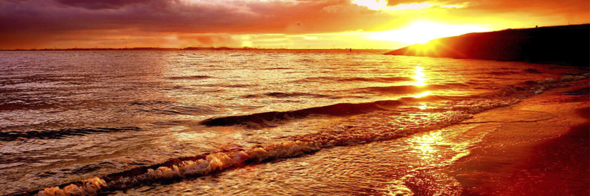

# The sea set on fire?

- **Category:** 
- **Date:** 23/03/2013
- **Author:** 
- **Source:** https://www.quranproject.org/The-sea-set-on-fire-440-d

## Content

“And by the sea kept filled (or it will be fire kindled on the Day of Resurrection)” (I)
This Qur’anic verse also comes in the context of an oath to emphasize the special significance of the subject matter by which the oath is given, as Allah (all glory be to Him) is definitely above the need to give such an oath. Now, what is the special significance of the ocean that is set on fire? Both water and fire were never thought to co-exist, as water quiches fire, and fire sets water to boiling and evaporation. How then can an ocean full of water be set on fire 7 Such contradiction has driven early commentators on the Glorious Qur’an to suggest that this could only happen on the Last Day, depending on another Qur’anic verse where such event is explicitly described
"And when the seas become as blazing Fire or overflow." (II)
Nevertheless, the context in which the oath:
“And by the sea kept filled (or it will be fire kindled on the Day of Resurrection)” (I)
“And 5 preceding realities are all in our present-day world, and hence another linguistic meaning for the adjective “al-masjour” other than ~~ set on fire” was earnestly searched for. Of the linguistic meanings derived from such an adjective is “full of water to a limit that does not allow any further transgression on the nearby continental masses” which is correct, because the largest quantity of fresh water today (77% of all water on land) is entrapped in the form of ice on the two polar regions as well as in the form of ice-caps to highly elevated mountains. Such a great mass of ice only needs an increase of 4°C - 5°Cabove the average summer temperatures to melt, and in such case, this melt can raise the water level in present-day seas and oceans by more than 100 m, which is enough to drown most of the present-day plains where the current civilizations mostly flourish, Nevertheless, Earth Scientists have recently discovered that some of the present-day seas and oceans (such as both the Red Sea and the Arabian Sea, the Atlantic, Pacific and Indian Oceans) are actually set on fire, while others (such as the Mediterranean, the Black and the Caspian Seas) are not. As mentioned above, more than 64,000 km of mid-ocean ridges have - so far- been mapped around mid-ocean rift valleys.
These are basically composed of volcanic basaltic rocks that have been pouring out from the oceanic rift zones (at temperatures of about 1000°Cor even more, to build up the mid-oceanic ridges and spread laterally, constructing new slabs of the oceanic crust on both sides of the rift zones. Mid-oceanic volcanism evolves from fissure volcanism that emanates from the mid-oceanic rift systems where the oceanic crust is rifted and the opposite sides of the rift zone are pushed aside by the emanating magma.
Basaltic flows and eruptions, fed from elongated secondary magma chambers below the center of the mid-oceanic ridge, pour out along the ridge axis. Sea-floor basalts from the surface of the oceanic crust, which is about 7 km thick (on the average) normally consist of: 0-1km of sediments (top) 1km of pillow lava basalts 5km of gabbro sills fed by dikes (bottom) Post-eruptive phenomena that can result from interaction of phereatic waters with buried hot rocks include the following:
Hot springs, which are formed when phreatic water is heated and mineralised in contact with hot rocks.
Geysers, which are periodic eruptions of boiling hot water (2000°Cor even more) due to circulation with super heated waters at depth which are in direct or indirect contact with hot rocks (1000 0C or even more).
Fumaroles, which are gaseous exhalations of water vapour, C02, CO, SO2, H25, HCI, and HF (in order of abundance).
Solfataras, which are fumaroles rich in sulphur compounds. Most of the present-day oceanic volcanic activity has been going on for the past 20-30 million years, although some have persisted in their activity for 100 million years or even more (e.g. the Canary Islands). During such long periods of activity, some volcanoes have been carried away for several hundred kilometres from the constantly renewed plate edge. Completing such drifting activity, volcanic cones become out of reach of the magma body that used to feed them, and hence fade out and die. The current floor of the Pacific Ocean contains a great number of submerged, subdued volcanic craters (guyots), besides a large number of violently active volcanoes (e.g. the Ring of Fire). From the above-mentioned discussion it is obvious that all seas and oceans that experience sea-floor spreading are actually set on fire, while closing seas and oceans are not. Such fire is emanating from very hot basaltic flows and other magmatic activities pouring out from the rift valley systems that rupture the Earth’s lithosphere.
Such ruptures run for tens of thousands of kilometres across the globe and in all directions to a depth of 65-150 km where it connects the extremely hot, plastic, semi-molten outermost mantle layer (Asthenosphere) with certain ocean bottoms that became actually set on fire.
This most striking fact of our planet was not known until the very late sixties and early seventies of this century.
The explicit Qur’anic notion to such a very striking, but deeply hidden fact of our seas and oceans is a clear testimony that this Glorious Book cannot be but the word of The Creator, in its Divine purity.
(I): Surah At-Tur (the Mount): V 6
(II): Surah At-Takwir (Wound Round and Lost its Light): V 6
Source: Dr. Zaghloul El-Naggar [External/non-QP]