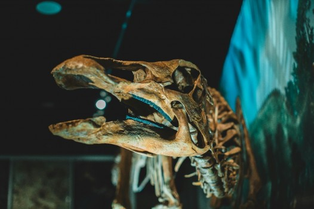

# Understanding Evolutionary Theory: An Introduction

- **Category:** 
- **Date:** 16/01/2026
- **Author:** ByA.B. al-Mehri
- **Source:** https://www.quranproject.org/Understanding-Evolutionary-Theory-An-Introduction-695-d

## Content

While evolution has been presented as the definitive scientific explanation for life's diversity, a rigorous examination of the evidence reveals fundamental flaws in the theory's claims, demonstrating that the observable complexity, order, and design in nature point not to blind chance, but to the deliberate work of an intelligent Creator.
For over a century, evolution has
been paraded as the ultimate triumph of "science"
over
religion. Yet when examined through the lens of reason and evidence, the theory
collapses under its own weight. Far from disproving God, it stands as one of
the greatest deceptions in modern intellectual history. When considered
without bias, the facts of biology, genetics, and physics affirm not chaos and
chance, but order, intelligence, design, and the unmistakable reality of a
Creator
.
Theory of Evolution
The Oxford University Press defines
evolution as the gradual process by which different kinds of living organisms
develop and diversify from earlier forms during the history of the Earth. This
definition emphasizes the biological aspect of evolution, particularly how
species adapt over time in response to environmental changes.
Originally proposed by Charles
Darwin in his 1859 book
On the Origin of Species
, the
theory of evolution explains the existence and diversification of species as
interconnected branches that trace back to basic cells in aquatic waters. The
theory suggests how species evolve over time through processes such as natural
selection, where advantageous traits are preserved and passed on to future
generations.
In this way, one could explain
the existence of various species without invoking a Creator. Instead, the
"creator" of each species would be considered its predecessor, from
which it supposedly evolved. As Richard Dawkins said,
"Darwin made it
possible to be an intellectually fulfilled atheist."
(1)
We can summarise the main
evidence used by proponents of the theory of evolution as follows:
1. Fossil record -
They argue that the fossil record provides
a wealth of evidence for the existence of extinct species and the transitional
forms that illustrate the gradual changes in species over time. They state that
the fossils show clear patterns of organisms appearing in a particular order,
with simpler forms found in older layers and more complex forms in more recent
layers.
2. Comparative anatomy -
They state that comparative anatomy reveals
striking similarities in the structures of different species, providing
evidence for common ancestry. Homologous structures, such as the pentadactyl
limb structure found in mammals, suggest a shared evolutionary history and
indicate descent from a common ancestor.
3. Embryology -
They say that the embryological
development often exhibits similarities among different species, reflecting
shared developmental pathways. The presence of embryonic features that resemble
ancestral traits and the occurrence of vestigial structures in embryos support
the evolutionary connection between species.
4. Biogeography -
The distribution of species across
different geographical regions, they say, is consistent with evolutionary
patterns. The presence of related species in close-proximity and the absence of
certain species in isolated regions can be explained by migration, adaptation,
and speciation over time.
5. Genetic evidence -
They argue that the DNA and genetic
analysis provide powerful evidence for evolution. Comparative genomics
demonstrates the presence of shared genetic sequences among different species,
indicating common ancestry. Genetic mutations, changes in DNA over generations,
can be traced and used to construct evolutionary relationships and timelines.
An evolutionary biologist would
typically explain the process of evolution as follows: "Species evolving
into other species would occur through a process called 'speciation,' which
occurs over a multitude of generations as populations adapt to their
environments. This would begin with genetic variation within a species, which
arises from mutations, gene recombination, and other factors. These variations
would provide different traits among individuals, some of which offer survival
or reproductive advantages in certain environments."
Then over a period of millions
of years, "natural selection" would favour individuals with
advantageous traits, allowing them to reproduce more successfully and pass
those traits to future generations. Additionally, random genetic changes, known
as genetic drift, would further alter the gene pool, especially in smaller
populations. When a population becomes geographically or reproductively
isolated, it stops exchanging genes with the original group. Over many
generations, this isolation would lead to significant genetic divergence
between populations.
As these genetic differences
would accumulate, the isolated population would become so distinct that even if
it were to reunite with the original group, they would no longer be able to
interbreed and produce fertile offspring. This would mark the creation of a new
species. The process is typically gradual, taking thousands to millions of
years, and occurs in various ways, such as through geographic separation
(allopatric speciation) or through ecological or behavioural changes within the
same environment (sympatric speciation). The example of "Darwin's
finches" is given to demonstrate this, where species evolved different
traits, such as beak size, to adapt to distinct ecological niches on the
Galapagos Islands.
In summary, evolutionary theory
maintains that the gradual accumulation of genetic changes and adaptations over
vast spans of time has led to the diversification of life, branching from
common ancestors into the multitude of species observed today, through random
processes that are unguided and without foresight.
Richard Dawkins
writes,
"Natural selection, the
blind, unconscious, automatic process which Darwin discovered, and which we now
know is the explanation for the existence and apparently purposeful form of all
life, has no purpose in mind. It has no mind and no mind's eye. It does not
plan for the future. It has no vision, no foresight, no sight at all. If it can
be said to play the role of watchmaker in nature, it is the blind
watchmaker."
(2)
(Taken from the book: '
God: There is No
Doubt!
')
Footnotes
(1) Richard Dawkins,
The Blind Watchmaker
(2) Richard Dawkins,
The Blind Watchmaker