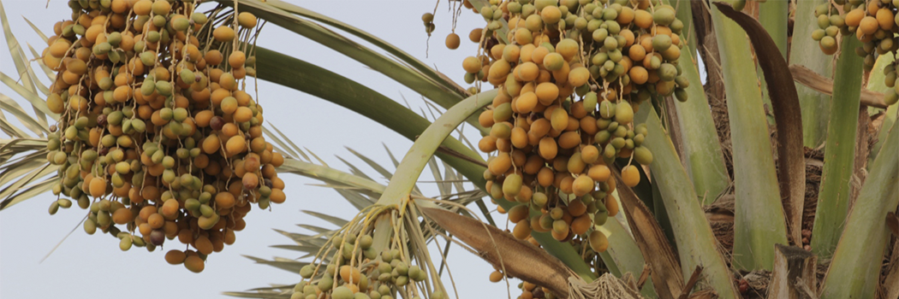

# "We made from water every living thing. Will they not then believe?"

- **Category:** 
- **Date:** 16/04/2013
- **Author:** 
- **Source:** https://www.quranproject.org/We-made-from-water-every-living-thing-Will-they-not-then-believe-467-d

## Content

“We made from water every living thing. Will they not then believe?"
This ayah is in Surah Al-Anbiyaa which was revealed in Makkah and has 112 ayahs. The main theme of the Surah revolves around faith:believing in Allah, His angels, His Books, His Messengers and the Day of Judgment. The Surah also focuses on Islamic monotheism, emphasizing that Allah has no partner, no equivalent, no spouse; no offspring and that none can dispute with Him concerning His power.
Signs of creation in Surah Al-Anbiyaa:
We can summarize the signs of creation mentioned in SurahAl-Anbiyaa, which shed light on Allah’s wonderful creation and His divine ability, as follows:
1.
The creation of the Heavens and the Earth in accurate proportions; they are arranged in an accurate and systematic manner.
2.
Theunity in the structure of the universe proves the Oneness of the Creator.
3.
The fact that the Heavens and the Earth were joined together as one before Allah separated them.
4.
The fact that Allah created every living thing from water.
5.
The fact that Allah created mountains to stabilize the Earth and that He made mountain passes for people to be able to pass through and to be guided by them.
6.
Emphasizing that Allah made the heavens as a well guarded ceiling.
7.
Reference to the rotation of the Earth on its axis around the sun and the alternation of the day and night. The course of the Earth, the sun and the moon through space are described as, “They float, each in an orbit”.
8.
Confirming that every soul shall taste death.
9.
Reference to the fact that man is hasty.
10.
Reference to the gradual reduction of the land from its outlying borders in a miraculous image.
11.
Reference to the Day when the heavens are rolled up like a scroll and the universe will return to its original form (joined together before it was separated into the heavens and the Earth).
One of the miracles of the Holy Qur’an is that it mentions how the Earth was created as well as how it will be destroyed in one Surah; this Surah also refers to creation of all living things between these two events.
All of these scientific issues need to be dealt with separately; therefore, I will focus my analysis on the fourth point in thislist, in which Allah says what can be translated as,
"We made from water every living thing, will they not then believe?"
I shall start with a brief review of the comments made by a number of scholars on this ayah:
Ibn-Kathir says:
"We made from water every living thing" means that water is the origin of all living things. Abu Huraira said, “O Messenger of Allah, when I see you, I feel happiness and contentment inside me; tell me about everything. The Prophet (PBUH) said, “Everything has been made from water.” Abu Huraira then said, “Tell me about an action that if I do it, I will go to heaven.” The Prophet said, “Spread greetings, feed the poor, maintain contact with your kin, pray at night when the people are asleep and you will enter heaven.”
The interpretation by Al-jalalein states the following:
"We made from water",  descending from the sky; "every living thing" produced by the earth, like plants, means that water is what keeps it alive; "will they not then believe"
in My Oneness.
Fi Zilal Al-Qur’an states:
“The second half of the ayah "We made from water every living thing," mentions a very important fact that scientists consider to be of great consequence; this fact is that water is the source for life. That the Qur'an mentions this fact does not surprise us and does not increase our belief in the truth of the Qur'an as we are well aware that the Qur’an is the Book of Allah and not because it agrees with scientific theories. For more than thirteen centuries, the Holy Qur'an has tried to guide the disbelievers to the wonders of Allah's creation in the universe. Moreover, the Qur’an rejects their disbelief in spite of their knowledge of its existence, "will they not then believe?" How can they not believe when everything in the world around them drives to believe in Allah who created them?”
Scientific implications in the ayah:
1.
Water preceded the existence of all created beings. All geological studies have proved the Earth’s age to be greater than 4.6 billion years ago whereas the age of the most ancient sign of life (fossils) in the Earth’s rocks is 3.8 billion y ears. This means that preparing the earth for life on its surface took over 800 million years. Allah is capable of enabling things to simply be, but the process of creation took a long period of time in order to help human beings follow Allah's system on earth and to make well use of it in constructing life.This is because both time and place are dimensions of matter and man's limitations are a part of Allah's creation, thus the created can never surpassits creator. Allah is above all His creations, including matter, energy, time and place. During this lengthy period, in which the Earth was being prepared to receive life, Allah created the volcanoes, which have been the main reason inthe forming of the  rock zone(lithosphere), water zone (hydrosphere) and air zone (atmosphere) of the Earth.Moreover, the extensive volcanic activities lead to create the mountain chains by extraction of the lava and magma (melted rocks) from the Earth’s interior under the paleo-oceanic (ancient oceans) crust until our planet was ready to receive different types of life forms.
2.
Allah created all early forms of life in water because, at that stage, water was the most suitable environment for life. Paleontological studies indicate that aquatic life (marine environments) prevailed in the Earth for about 3360 million years (from 3800 to 440 million years ago) before the creation of the first type of plants on land.
3.
Geological studies have proved that the creation of plants preceded the creation of animals. Therefore, the creation of aquatic plants preceded the creation of aquatic animals. Additionally, the creation of plants on land was earlier than the creation of animals on land. All these forms of life preceded the creation of man whom Allah Has honoured. The reason for this order in creation is quite clear, as human beings depend on plants and animals for nutrition. Furthermore,both human beings and animals depend on plants for their food. Plants play the key role in supplying the earth’s atmosphere with oxygen, essential for the life of humans and animals.
Green plants are also the natural factory for the creation and re-creation of organic particles. These organic particles are necessary for plants, animals and humans; these particles are made from water and food substances (sap) absorbed from the soil together with carbon dioxide from the atmosphere and energy from the sun. Water is essential for photosynthesis. A molecule of water (H2O) is composed of two hydrogen atoms and one oxygen atom. Plants obtain water by absorbing it from the soil and rocks through their roots. Plants obtain energy from sunlight through the chlorophyll that Allah has put in the plant's cells. Allah has given plants the ability to break down a water molecule into a hydrogen ion carrying a positive electric charge (H+) and a hydroxide ion carrying a negative electric charge (-OH). Two hydroxide ions combine to form a water molecule and an oxygen atom which is released into the atmosphere and is then used by all other living creatures for respiration. The hydrogen ions (H+) that are released from the breakdown of water combine with the carbon dioxide (CO2) the plant obtains from the surrounding atmosphere to make all kinds of organic particles that are needed to build living cells, beginning with the simplest carbohydrate particles such as glucose and starch,  and ending with proteins, oils, fats and chemical compounds of amino and nuclear acids that form the DNA of every living thing.
Through this process, plants store part of the solar energy they receive in the form of chemical bonds. The hydrogen ions which are found in water play a major role in this process, while the oxygen which is released from water into the air through photosynthesis is used by all living creatures for respiration, which causes the oxidation of organic substances in food. It is obtained directly from plants (or indirectly from animals as carbon dioxide and water) transforming part of the solar energy that had been used by the plant into heat energy (as a result of the activities of living organisms),or leaves it in the form of remains and wastes that oxidize and return back to the air.
It is obvious that water is essential in building the bodies of all living organisms. It is important in helping them to continue doing their different vital activities.
1.
Water is the most efficient solvent ever known. It acts as a solvent for a number of elements and compounds that are transported from the soil to different parts of the plant and from food to all parts of the human and animal bodies. That is because it has a high viscosity and surface tension as well as maximum capillarity.
Water is the main element of all living organisms. It has been proved that the percentage of water in a human body is 71% in an adult and 93% in an embryo that is a few months old.
2.
Watercomposes more than 80% of human blood and more than 90% in the bodies of a large number of plants (sap) and animals.
3.
Allvital actions and processes like nutrition, excretion, growth and reproduction cannot be undertaken without water: photosynthesis, the exchange of solutions between cells due to the capillarity of aquatic solutions as they pass throught he cell wall (osmosis) and the building of new cells and tissues that help growth and reproduction. Water is also needed to get rid of toxins and body waste through excretion and secretion.
Water is also essential for other functions such as swallowing, digesting, transporting and distributing food, vitamins, hormones, immunity system elements and oxygen to all parts of the body. There can be no life without water. It is essential for the excretion of wastes and toxins and maintaining the temperature and humidity of the body. There is no living organism that can completely live without water.
As well as its function in maintaining body temperature, controlling blood pressure and levels of acidity, a shortage of water can cause the cells to become dehydrated disrupting their work. It may also cause tissues to dry, joints to stick together, blood to clot and the living organism to perish.The symptoms of a shortage of water in the body of a living organism are dangerous. For instance, if a person loses just 1% of the water in his body, he will feel thirsty. If this percentage is 5%, his tongue and mouth will become dry, he will have difficulties talking and will suffer from weakness. If the percentage increases to 10%, he will die.
At the same time, an increase in the percentage of water in the body of the living organism may also lead to his death. An increase in the percentage of water in the body causes vomiting, general weakness and ends in a comma that leads to death.
Water covers 71% of the earth’s surface which is 510 million square kilometres (km2), while the land occupies 29% of the whole surface area. Earth is the richest planet in the solar system as concerns water. The amount of water at the surface is estimated at 1.4 billion cubic kilometres(km3); it also has stores of water below the surface (underground water),especially in the weak sphere (asthenosphere) of the Earth estimated at more than a hundred times that amount. Kindly, this groundwater always extracts to the surface at the suitable time by the will of Allah Almighty through the volcanic activities.
At the earth’s surface, most of the water (97. 22%) is distributed in seas and oceans that cover 362 million km2, with an average depth of 3800 meters (below the sea level) that give the seas and oceans a content of slightly more than 1375 million km3 of salty water. Furthermore, the amount of ice that covers the earth’s two poles and the apex of the mountains have a thickness of 4 kilometres in the South Pole and 3800 meters in the North Pole; the amount of water contained in these icebergs 2.15% of the water found on the earth’s surface. The remaining amount, estimated at 0.63% of the water found on the earth’s surface, is largely stored in the rocks (underground water) that are found on the earth’s crust. An amount of 0.017% is found in lakes and in rivers, the humidity in the air and the soil that help plants to grow; it also plays a vital role in forming clouds that shade the earth from many of the sun’s burning rays during the day, whilst also returning the warmth that has been emitted by the rocks as soon as the sun has set.
This miraculous distribution of water on the earth’s surface plays a major role in controlling the earth’s climate to accommodate life. Without these vast watery and icy areas, life would have been impossible on Earth as the temperature could have reached more than 100oC during the daytime and decreased to -100oC at night; these conditions are impossible for the existence of life. However, Allah Had mercy upon us by creating this the water(hydrosphere) system that controls the temperature, the constant evaporation of large amounts of water (380,000 km3 per year) and the condensation of this water in the form of clouds, fog and dew that then falls as rain, ice and snow,accompanied by thunder and lightning, releasing nitrogen compounds and other elements that enrich the soil with compounds that are needed by the plant.
Water helps regulate the temperature in the seas and oceans maintaining marine life. This is through a combination of hot and cold sea currents, the absorption of a great amount of sunlight and energy from the activities of the various marine life forms and the redistribution of this heat together with the heat obtained from volcanoes that erupt on the troughs of the oceans and on a number of seas. The most important function of water is in protecting aquatic life from climate changes, especially when the temperature decreases to below zero.
Every rational person can therefore notice this amazing creative power that gave water a number of physical and chemical characteristics that are not found in other elements. The most obvious characteristic is its low density when it freezes, enabling it to float on the surface of the seas and oceans instead of sinking to the bottom and destroying the various life forms that exist there. These floating icebergs on the water’s surface act as insulators between the cold air surrounding them and the relatively warm water underneath. This is only a little of the many unique natural and chemical characteristics that Allah SWT has instilled in water.
Another very important characteristic is water’s great ability to dissolve large amounts of solids, liquids and gases. Moreover, the molecular structure of water with its double pole and resistance to dissolution and ionization, together with its special freezing and boiling points and the high specific and latent heat, impressive viscosity and surface tension, low density in freezing, its great ability in the processes of oxidation and reduction and to react with many chemical compounds help to crack the soil to facilitate the germination of plants. Allah has therefore enabled it to carryout a major role in all plants, animals and people. It is considered to be one of the great miracles of Allah, revealed in His Holy Book over 1400 years ago
This ayah is mentioned immediately after the process of the creation of the heaven and the earth, which is one of the greatest miracles of Allah s.w.t, Allah is addressing the disbelievers in this ayah, which is why it ends with the reprehending interrogative,
“will they not then believe?”
These are facts that mankind had not been aware of before the twentieth century; they are mentioned in the Qur’an in a precise and concise manner that proves that the Qur'an is the word of Allah and proves the Prophethood of the Prophet, Muhammad (PBUH). Peace and blessings be upon him and his family and companions and all who follow his guidance until the Day of Judgment.
SurahAl-Anbiyaa (The Prophets) 21:30
Source: Dr.Zaghloul El-Naggar [External/non-QP]