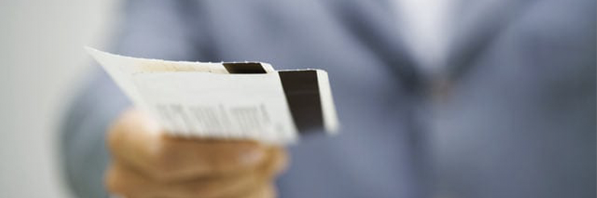

# Welcome Aboard Fly Air Janazah

- **Category:** 
- **Date:** 24/02/2013
- **Author:** 
- **Source:** https://www.quranproject.org/Welcome-Aboard-Fly-Air-Janazah-299-d

## Content

When we are leaving this world for the next one, it shall be like a trip to another country.
Where details of that country won't be found in glamorous travel brochures but in the Holy Qura'an and the Hadiths.
Where our plane won't be Indian Air Lines, British Airways, Gulf Air or Emirates but Air Janazah.
Where our luggage won't be the allowed 30 Kgs but our deeds no matter how heavy they weigh.
You don't pay for excess luggage. They are carried free of charge, with your Creator's compliment.
Where our dress won't be a Pierre Cardin suit or the like but the white cotton shroud.
Where our perfume won't be Channel, Paco Rabane, but the camphor and attar.
Where our passports won't be Indian, British, French or American but Al Islam.
Where our visa won't be the 6 months leave to stay or else but the "La Illaha Illallah". Where the airhostess won't be a gorgeous female but Isra'iil and its like.
Where the in-flight services won't be 1st class or economy but a piece of beautifully scented or foul smelling cloth. Where our place of destination won't be Heathrow Terminal 1 or Jeddah International Terminal but the last Terminal Graveyard.
Where our waiting lounge won't be nice carpeted and air-conditioned rooms but the 6 feet deep gloomy Qabar. Where the Immigration Officer won't be His Majesty's officers but Munkar and Nakeer. They only check out whether you deserve the place you yearn to go.
Where there is no need for Customs Officers or detectors. Where the transit airport will be Al Barzakh. Where our final place of destination will be either the Garden under which rivers flow or the Hellfire. This trip does not come with a price tag. It is free of charge, So your savings would not come handy. This flight can never be hijacked so do not worry about terrorists.
Food won't be served on this flight so do not worry about your allergies or whether the food is Halal. Do not worry about legroom; you won't need it, as our legs will become things of the past. Do not worry about delays.
This flight is always punctual. It arrives and leaves on time.
Do not worry about the in-flight entertainment program because you would have lost all your sense of joy. Do not worry about booking this trip, it has already been booked (return) the day you became a foetus in your mother's womb.
Ah! At last good news! Do not worry about who will be sitting next to you. You will have the luxury of being the only passenger. So enjoy it while you can. If only you can! One small snag though, this trip comes with no warning.
Are you prepared???
.....you better be!
Source:   missionislam.com  [External/non-QP]