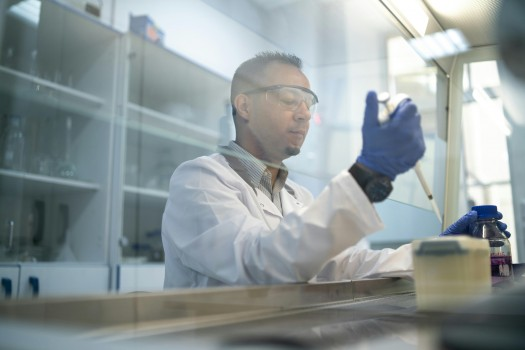

# What do Leading Scientists Believe About God & Science? - Part 2

- **Category:** 
- **Date:** 23/01/2026
- **Author:** ByA.B. al-Mehri
- **Source:** https://www.quranproject.org/What-do-Leading-Scientists-Believe-About-God--Science---Part-2-709-d

## Content

The testimonies of Nobel laureates and leading scientists across physics, chemistry,
biology
, and medicine reveal that scientific inquiry, rather than leading away from faith, consistently points toward the existence of an intelligent Creator whose fingerprints are evident in the precise design, fine-tuning, and purposeful order of the universe.
Carlo Rubbia
(1934–)
Professor of Physics at Harvard, Director of CERN, expert in
particle physics, 1984 Nobel laureate:
"Speaking of the origin of the
world brings us inevitably to think of creation, and, in considering nature, we
find that it has an order too precise to have been determined by 'chance,' from
confrontations between 'forces' that we – physicists – continue to maintain.
However, I believe that the existence of a pre-established order of things is
more evident among us than elsewhere. We come to God by the path of reason,
others follow the irrational path."
(1)
Michael Faraday
(1791–1867)
Experimental physicist and chemist, discoverer of
electromagnetic induction:
"The book of nature which we
have to read is written by the finger of God."
(2)
Isidor Isaac Rabi
(1898–1988)
Winner of the 1944 Nobel Prize in Physics:
"Physics filled me with awe, put
me in touch with a sense of original causes. Physics brought me closer to God.
That feeling stayed with me throughout my years in science."
(3)
Allan Sandage
(1926–2010)
One of the most celebrated astronomers in modern times, who
recognised his belief in God at the age of fifty:
"The world is too complicated in
all parts and interconnections to be due to chance alone."
(4)
Max Planck
(1858–1947)
Founder of quantum theory and 1918 Nobel laureate in Physics:
"There can never be any real
opposition between religion and science; for the one is the complement of the
other. Every serious and reflective person realizes, I think, that the
religious element in his nature must be recognised and cultivated if all the
powers of the human soul are to act together in perfect balance and
harmony."
(5)
Derek Barton
(1918–1998)
Professor of Chemistry at Imperial College and Harvard University,
and 1969 Nobel Laureate in Chemistry:
"The observations and
experiments of science are so wonderful that the truth they establish can
surely be accepted as another manifestation of God. God shows Himself by
allowing man to discover truth."
(6)
Walter Kohn
(1923–2016)
Professor of Physics at the University of California and winner of
the 1998 Nobel Prize in Chemistry:
"There continue to be very deep
epistemological questions about the significance of sharp scientific laws, such
as the laws of quantum mechanics and the laws that govern the nature of chaos.
Both of these fields have irreversibly shaken the purely deterministic and
mechanistic view of the world that dominated the 18th and 19th centuries."
(7)
George Wald
(1906–1977)
Professor of Sensory Physiology at Harvard University and winner
of the 1967 Nobel Prize in Medicine:
"And now for my main thesis: if
any one of a considerable number of the physical properties of our universe
were otherwise – some of them basic, others seemingly trivial or almost
accidental – then life, which now seems so prevalent, would be impossible, here
or anywhere."
(8) and
"When it comes to the origin of life, there
are only two possibilities: creation or spontaneous generation. There is no
third way. Spontaneous generation was disproved one hundred years ago, but that
leaves us with only one other conclusion – the supernatural creation of life.
We cannot accept that on philosophical grounds; therefore, we choose to believe
the impossible: that life arose spontaneously by chance."
(9)
John Eccles
(1903–1997)
Neurologist, electrophysiologist, and winner of the 1963 Nobel
Prize in Medicine:
"I maintain that the human
mystery is incredibly demeaned by scientific reductionism, with its claim in
promissory materialism to account eventually for all of the spiritual world in
terms of patterns of neuronal activity. This belief must be classed as a
superstition."
and
"I am constrained to attribute the
uniqueness of the Self or Soul to a supernatural spiritual creation."
(10)
Werner Arber
(1929–)
Microbiologist and winner of the 1978 Nobel Prize in Medicine:
"Life only starts at the level
of a functional cell. The most primitive cells may require at least several
hundred different specific biological macromolecules. How such already quite
complex structures may have come together remains a mystery to me. The
possibility of the existence of a Creator, of God, represents to me a
satisfactory solution to this problem."
(11)
Jacques Monod
(1910–1976)
Atheist, biologist, and biochemist at the Pasteur Institute in
Paris, Nobel Laureate in Physiology or Medicine (1965):
"The machinery by which the
cell—at least the non-primitive cell, which is the only one we know—translates
the code consists of at least fifty macromolecular components, which are
themselves coded in the DNA. Thus, the code cannot be translated except by
using certain products of its translation. This constitutes a baffling circle -
a really vicious circle, it seems—for any attempt to form a model or theory of
the genesis of the genetic code."
(12)
Ernst Chain
(1906–1979)
Professor at the Universities of Berlin, Cambridge, and Oxford;
pioneer in the development of penicillin; and 1945 Nobel Laureate in
Physiology/Medicine:
"I would rather believe in
fairies than in such wild speculation. Speculations about the origin of life
lead to no useful purpose, as even the simplest living system is far too
complex to be understood in terms of the extremely primitive chemistry
scientists have used in their attempts to explain the unexplainable that
happened billions of years ago. God cannot be explained away by such naive
thoughts."
(13)
Roger Sperry
(1913–1994)
Neurologist and winner of the 1981 Nobel Prize in Medicine:
"I must take issue especially
with the whole general materialistic-reductionist conception of human nature
and mind that seems to emerge from the currently prevailing objective, analytic
approach in the brain-behaviour sciences. I suspect that we have been taken—that
science has sold society, and itself, a somewhat questionable bill of
goods."
(14)
Francis Collins
(1950–)
Geneticist, Director of the U.S. National Institutes of Health,
and leader of the Human Genome Project:
"Belief in God can be an
entirely rational choice, and the principles of faith are, in fact,
complementary to the principles of science."
(15)
Paul Dirac
(1902–1984)
One of the founders of quantum mechanics and winner of the 1933
Nobel Prize in Physics:
"God is a mathematician of a
very high order, and He used very advanced mathematics in constructing the
universe."
(16)
Albert Einstein
(1879–1955)
Theoretical physicist and Nobel Laureate in Physics (1921):
"I'm not an atheist. I don't
think I can call myself a pantheist. What separates me from most so-called
atheists is a feeling of utter humility toward the unattainable secrets of the
harmony of the cosmos...The fanatical atheists are like slaves who are still
feeling the weight of their chains, which they have thrown off after hard
struggle. They are creatures who, in their grudge against the traditional
'opium of the people,' cannot hear the music of the spheres."
(17)
"I want to know how God
created this world. I am not interested in this or that phenomenon, in the
spectrum of this or that element. I want to know His thoughts; the rest are
details."
(18)
Conclusion
The evidence across these two parts dismantles the myth that science and faith are at odds. With 90% of Nobel laureates identifying as religious, the "conflict" is revealed to be a social narrative rather than a scientific reality. From the founders of quantum mechanics to the leaders of the Human Genome Project, the world’s greatest minds have consistently viewed the universe not as a cosmic accident, but as a masterpiece of "pre-established order."
Whether calculating the staggering precision of the Big Bang or marveling at the "vicious circle" of the genetic code, these pioneers found that reason leads inevitably to a Creator. As their testimonies show, science is not a replacement for God, but a rigorous method of discovering His wisdom. The universe is an intentional, rational creation—a truth confirmed by those who have studied it most deeply.
(Taken from the
book:
‘God: There is
No Doubt!’
)
Footnotes
(1) “L’ADN le prouve: la vie sur terre n’a qu’un père,” Libéral, December 23, 2011,
https://www.uccronline.it/wp-content/uploads/2012/08/20111223rubbia.pdf.
(2) Faraday’s Diary: Being the Various Philosophical Notes of Experimental Investigation (vol. 2, entry dated March 19, 1827)
(3) Gerald Holton, “I. I. Rabi As Educator and Science Warrior,” Physics Today 52 (Sept. 1999), 37. Also quoted in John S. Rigden, “Nearer to God,” in Rabi, Scientist and Citizen (Cambridge, MA: Harvard University Press, 1987).
(4) Cited in Allan Sandage, “A Scientist Reflects on Religious Belief,” Truth Journal 1 (1985).
(5) Lecture Religion and Natural Science (1937)
(6) Derek Barton, Cosmos, Bios, Theos, ed. Henry Margenau and Roy Abraham Varghese
(Chicago: Open Court, 1997), 145.
(7) Walter Kohn, Dr. Walter Kohn: Science, Religion, and the Human Experience, interview by John F. Luca, The Santa Barbara Independent, July 26, 2001.
(8) George Wald, address at the First World Congress for the Synthesis of Science and Religion.
(9) George Wald, The Origin of Life, Scientific American 191, no. 2 (1954): 48.
(10) Jojn C. Eccles, Evolution of the Brain: Creation of the Self. Routledge.
(11) Werner Arber, The Existence of a Creator Represents a Satisfactory Solution, in Cosmos, Bios, Theos, ed. H. Margenau and R. Varghese, Open Court.
(12) In Don Batten, “Origin of life: An explanation of what is needed for abiogenesis (or biopoiesis),” http://www.esalq.usp.br/lepse/imgs/conteudo_thumb/Origin-of-life.pdf, page 11.
(13)  Quoted by Ronald W. Clark, The Life of Ernst Chain: Penicillin and Beyond, Weidenfeld & Nicolson.
(14)  Roger Sperry, Science and Moral Priority. Columbia University Press, p. 28.
(15)  Francis Collins, Language of God. Simon & Schuster.
(16)  Paul Dirac, The Evolution of the Physicist’s Picture of Nature, Scientific American 208, no. 5 (May 1963).
(17)  Walter Isaacson, Einstein and Faith, Time 169 (April 5, 2007). https://time.com/archive/6680629/einstein-faith
(18) Esther Salaman, A Talk with Einstein, The Listener.