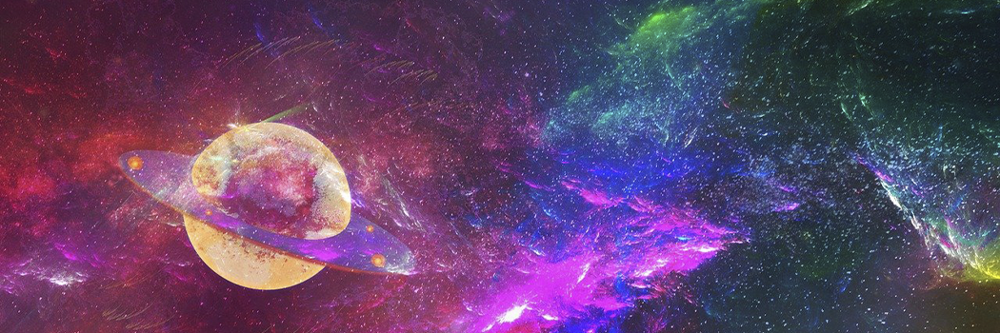

# Who Created the Universe and Why ?

- **Category:** 
- **Date:** 24/02/2013
- **Author:** 
- **Source:** https://www.quranproject.org/Who-Created-the-Universe-and-Why--324-d

## Content

Can it Be that the Universe Created Itself?
Virtually every human being has pondered this question. Some answered by saying that the formation of the universe was merely a coincidence. Others felt there must be an unseen Creator. In what will follow, we will try to assist you in answering this question. Our approach will depend primarily on the text of the Qur'an (the Word of Allah (i.e. God), inspired to Prophet Muhammad (saws)). We request only that you open your mind and read.
Allah asks in the Qur'an:
"Were they created out of nothing? Or were they themselves the creators? Or did they create the heavens and the earth? Nay, but they are sure of nothing!"
Qur'an 52:35-36
Most deny or ignore the existence of The Creator because they cannot see Him. However, there are many things which we do not see, but yet we believe in their existence. Further, most of us believe in creatures which exist yet undiscovered and undocumented.
Many reject the existence of The Creator, believing only in science and data gathered and confirmed by its canonical methods.
But, on any given day, the same person might find himself in love, deep remorse or sadness. And while contriving the most complex and personal thoughts, he does not, at the time, suppose that his feelings are a random product of firing neurons. How can he then believe that the only distinction between a corpse and a living person is the absence of organ functionality. That we need only revive his physical body to restore him to normality.
The Scientific Proof
Let us imagine ourselves standing in a laboratory stocked with beakers and test tubes containing all sorts of chemical compounds. Then suppose an earthquake has just occurred upsetting the shelved vessels, sending their contents spilling onto the laboratory floor. It would be a very strange coincidence indeed to find new life forms generating themselves where none had existed before.
You might say, 'Your analogy didn't account for time - these organisms need time to evolve.' We ask, 'How much time should we have allowed? Was there enough time since the beginning of the universe to allow for their self-induced formation?'
Let's hear from Swiss mathematician Charles Eugene Jai. In an experiment aimed at answering this very question, Jai set out to calculate the probability of the random formation of a single protein molecule. Jai 'helped' the situation by assuming the existence of formative elements, and by selecting a protein consisting of only 2,000 atoms (An average protein might consist of 32,000 atoms or more). Jai also assumed that the protein would consist of only 2 unique formative atoms.
He determined the value of probability by considering the size of the material and the time necessary for the random formation to occur. He calculated that the probability of forming even a simplified protein molecule was approximately 1 in 5 x 10 e+320 !
The size of the material necessary to produce that almost zero probability would have been a sphere with a diameter of approximately 6 x 10 e+176 miles - about 10 e+63 times bigger than the imagined size of the universe. Finally, the time necessary for the molecule to form was 10 e+243 billion years. This was far greater than the supposed age of the universe - only about 2 billion years.
He concluded that the universe was neither old enough, nor big enough to allow for the random formation of even a simple protein molecule. It was impossible for the universe to have created itself, and for life to randomly form. We must then consider another course. There is a Creator who created the universe.
Some Unmistakable Signs of the Creator
Allah said in the Qur'an:
"We* (Allah) shall show them Our Signs on the horizons and within themselves, until it becomes clear to them that it is the Truth. Is it not sufficient that the Lord is Witness over all things?"
Qur'an 41:53
* One of the usages of 'we' in Arabic is for glorifying and indicating the greatness of a person. Here it indicates greatness and not plurality.
We live in an amazing universe. It is a universe peculiarly balanced, and purposefully tempered as if to provide a safe host for living creatures.
According to modern astronomers, the universe is expanding. They hold that if gravity had been only slightly stronger, it would have overtaken expansion very early and caused the universe to collapse. Had gravity been slightly weaker, universe expansion would have become a runaway process, not allowing time for the formation of galaxies and stars.
If either of these had occurred, there would never have been an Earth on which creatures could live. This universe seems designed, even meticulously tailored to provide suitable conditions for living. If other basic ratios and constants had been just slightly different, the universe would not have been favourable to our existence.
If, for instance, the strong and weak nuclear forces were slightly stronger relative to the electromagnetic forces, hydrogen would not exist in its ordinary form. This would mean that heavier elements, such as carbon and oxygen - two of the essential building blocks of life - would never have existed.
The strength of gravity is crucial to the existence of life in the universe in another way. If it were weaker, then it could not crush the material in a star the size of the Sun with enough force to ignite its thermonuclear reactions. Only very massive stars would shine, and such stars would probably have too short lifespan to allow for the development of life.
These indications that the universe has been arranged to favour the appearance and survival of life has been taken very seriously by certain scientists. Prominent among them is astronomer Brandon Carter. Modern science estimates that it has taken 4 billion years for human beings to evolve from unicellular life forms.
Carter has calculated that the average period for any evolution of this magnitude should take much longer - about 10 billion years. That is longer than the lifespan of a Sun-sized star, and much longer than the period of life-favourable conditions on Earth.
It would seem that intelligent life appeared on Earth despite its high improbability. We are again pulled towards recognizing the Creator.
Signs for the Aware
"Behold! In the creation of the heavens and the earth, and the alternation of the night and day, and the sailing of ships through the ocean for the profit of mankind, and the water which Allah sends down from the skies, thereby reviving the earth after its death, and dispersing therein all kinds of beasts, and (in) the ordinance of the winds, and the clouds subjugated between heaven and earth: are signs for people who have sense."
Qur'an 2:164
The Creation of Heaven and Earth
"Who has created the heavens and the earth, and Who sends down for you water from the sky? Yea, with it We cause to grow well-planted orchards full of beauty and delight: it never has been yours to cause to grow. Could there be another god besides Allah? Nay, but they are people who swerve from justice."
"Who has made the earth firm to live in, and placed rivers in its folds, and set upon it immovable mountains, and made a barrier between the two seas (fresh and salt waters)? Could there be another god besides Allah? Nay, most of them know not."
"Who answers the one distressed when he calls unto Him, and Who relieves the harm, and makes you (mankind) inheritors of the earth? Could there be another god besides Allah? Little do they reflect!"
"Who guides you through the depths of darkness in the land and the sea, and Who sends the winds as heralds of His Mercy? Could there be another god besides Allah? High is Allah above what they ascribe to Him!"
"Who originates creation, then repeats it, and Who gives you sustenance from heaven and earth? Could there be another god besides Allah? Say, " Bring your proof, if you are truthful!"
"Say: None in the heavens or on earth, except Allah, knows what is hidden. Nor are they able to perceive when they shall be resurrected (for Judgment)."
Qur'an 27:60-65
"Allah is He Who sends the winds which push up the clouds. Then He leads them unto a dead land and revive therewith the earth after its death. Such is the Resurrection!"
Qur'an 35:9
"Have they not seen that Allah causes water to fall from the sky? Then with it We produce fruit of various colours; and among the hills are streaks white and red, and of various colours, and (others) of raven-black."
"And so amongst men and beasts and cattle, in like manner, various colours. Verily those who truly fear Allah, among His Servants, are those endued with knowledge, and Allah is Exalted in Might, Oft-Forgiving."
Qur'an 35:27-28
"Allah sends down water from the sky and therewith revives the earth after its death. Verily in this is a sign for those who listen."
Qur'an 16:65
"Have they not then observed the sky above them, how We have constructed it and beautified it, and how there are no rifts in it?"
"And We have spread out the earth, and have flung firm hills therein, and have caused every lovely thing to grow thereon (in pairs)."
"A vision and a reminder for every repentant servant."
"And We send down from the sky blessed water whereby We give growth unto gardens and the grain of crops,"
"And lofty date-palms with ranged clusters."
"Provision (made) for (Allah's) Servants; and therewith We quicken a dead land. Like so will be the resurrection of the dead."
Qur'an 50:6-11
"Allah is He Who raised the heavens without pillars that you can see, then mounted the Throne, and compelled the sun and the moon to be of service (to his Law)! Each runs (its course) unto an appointed term. He regulates all affairs, explaining the revelations, that you may be certain of the meeting with your Lord.
And Allah is He who spread out the earth and placed therein firm hills and flowing streams, and of all fruits He placed therein two spouses (male and female). He covered the night with day. Behold! Herein verily are signs for people who take thought.
And in the Earth are neighbouring tracts, vineyard and ploughed lands, and palm trees, like and unlike, watered with one water (the same water). And We have made some of them to excel others in fruit. Behold! Herein verily are signs for people who have sense."
Qur'an 13:2-4
The Creation of Mankind
"Verily We created man from a product of wet earth (clay).
Then placed him as a drop (of sperm) in a safe lodging.
Then We fashioned the drop into a clot, then We fashioned the clot into a little lump, then We fashioned the little lump into bones, then clothed the bones with flesh, and then produced it as another creation. So blessed be Allah, the Best of creators!
Then Behold! After that you surely will die.
Then, on the Day of Resurrection you will be raised (again)."
Qur'an 23:12-16
"And Allah brought you forth from the wombs of your mothers knowing nothing, and gave you hearing and sight and hearts that you might give thanks."
Qur'an 16:78)
"He brings forth the living from the dead, and He brings forth the dead from the living, and He revives the earth after its death. And like so you will be brought forth (from death).
And of His Signs is this: He created you from dust, and then, behold you are human beings, ranging widely!
And of His Signs is this: He created for you mates from yourselves that you might find rest in them, and He ordained between you love and mercy. Behold! Herein indeed are Signs for those who reflect.
And of His Signs are the creation of the heavens and the earth, and the variations of your languages and colours. Behold! Herein indeed are signs for those who know.
And of His Signs is your sleep by night and by day, and your seeking of His Bounty. Behold! Herein indeed are signs for those who heed.
And of His Signs is this: He shows you the lightning for fear and for hope, and sends down water from the sky, and thereby revives the earth after its death. Behold! Herein indeed are signs for those who understand."
Qur'an 30:19-24
Signs in the Other Creatures
"Behold! In the cattle there is a lesson for you. We give you to drink of that which is in their bellies, from between the refuse and the blood, pure milk palatable to the drinkers.
And of the fruits of the date-palm, and grapes, you derive strong drink and (also) good food. Behold! Therein is indeed a sign for people who have sense.
And the Lord inspired the (female) bee: "Choose your habitations in the hills and in the trees and in that which they (humans) dwell."
Then eat of all fruits, and follow the paths of your Lord (which were) made smooth". There comes forth from their bellies a drink of diverse hues (honey), and wherein is healing for mankind. Behold! Herein is indeed a sign for people who give thought."
Qur'an 16:66-
"And We have placed therein gardens of the date-palm and grapes, and We have caused springs of water to gush forth therein. That they may eat of the fruit thereof, which their hands did not make. Will they not, then, give thanks? Glory be to Him Who created all the pairs of that which the earth grows, and of themselves, and of that which they know not! And a reminder for them is night. We strip it of the day, and behold! They are in darkness. And the sun runs on unto a resting-place (orbit) for it. That is the measuring of the All-Mighty, the All-Wise. And for the moon We have appointed mansions until it returns like an old shriveled palm-leaf. It is not permitted that the sun catch up to the moon, nor can the night outstrip the day: All float in an orbit. And a reminder for them is that We bear their offspring in laden ship, And We have created for them similar on which they ride. And if We will, We drown them, and there is no help for them, neither can they be saved. Unless by mercy from Us and as comfort for a while. When they are told: Fear that which is before you and that which is behind you, that you may find mercy (they are heedless). Never did a sign come to them (the unbelievers) of the signs of their Lord, but they did turn away from it!"
Qur'an 36:33-46
"Allah, The Creator Subjected the Universe to Human Control
And the cattle He has created for you. From them you have warm clothing and uses, and whereof you eat. And wherein is beauty for you, when you bring them home, and when you take them out to pasture. And they carry your loads unto a land you could not reach except with souls distressed. Behold! Your Lord is indeed Most Kind, Most Merciful And (He has created) horses and mules and donkeys that you may ride them, and for ornament. And He creates that which you know not. And depend on Allah for direction to the Straight Path, but some (paths) go not straight: And had He willed He would have led you all aright (by His Guidance). Allah is He Who sends down water from the sky, from it you have drink, and out of it (grows) the vegetation with which you feed your cattle. Therewith He causes crops to grow for you, and the olive and the date-palm and grapes and fruits of all kinds. Behold! Herein is indeed a sign for people who reflect. And He has constrained the night and the day and the sun and the moon to be of service unto you, and the stars are made subservient by His command. Behold! Herein indeed are signs for people who have sense. And whatsoever He has created for you in the earth of diverse hues, Behold! Therein is indeed a sign for people who take heed. And Allah is He Who has constrained the sea to be of service that you eat thereof flesh that is fresh and tender, and bring forth from it ornaments to wear. And you see the ships plowing therein, that you (mankind) may seek of His bounty and that you may be grateful. And He has cast into the earth firm hills that it quakes not with you, and streams and roads that you may find your way. And landmarks (too), and by the stars they find their ways. Is He then Who creates like one who does not create? Will you not then remember? And if you try to count the favours of Allah you cannot number them. Behold! Allah is indeed Oft-Forgiving, Most Merciful."
Qur'an 16:5-18
"Allah has given you in your houses and abode, and has given you (also), of the hides of cattle, houses which you find light (to carry) on the day of migration and on the day of pitching camp; and of their wool and their fur and their hair, caparison and comfort (to serve you) for a time. And Allah has given you, of that which He has created, shelter from the sun; and has given you places of refuge in the mountains, and has given you coats with which to ward off the heat, and coats (of armour) to save you from your own foolhardiness. Thus He perfects His favour unto you, in order that you may surrender (unto Him). But if they turn away, your duty is only to preach the Clear Message. They (the unbelievers) know the favour of Allah but then deny it. Most of them are ingrates."
Qur'an 16:80-83
"Allah is He Who appointed the sun a splendour and the moon a light, and measured for it stages, that you might know the number of the years, and the count (of time). Allah did not create (all) that but in Truth. He details the revelations for people who have knowledge. Behold! In the difference of day and night and all that Allah has created in the heavens and the earth are portents, for those who fear Him.
" Qur'an 10:5-6
"Will they not look at the camels, how they are created? And the heavens, how it is raised? And the hills, how they are fixed firms? And the earth, how it is spread out? Remind them, for you are not but a reminder."
Qur'an 88:17-21
The Purpose of the Creation of Human Beings?
"We did not create the heaven and the earth and all that is between them in play. If We had wished to find pastime, We could have found it in Our Presence - if ever We did."
Qur'an 21:16-17
"I have not created jinn nor men except to worship Me. I seek no livelihood from them, nor do I ask them to feed Me. Behold! Allah is He Who gives livelihood, the Lord of Unbreakable Might."
Qur'an 51:56-58
A Question for the Atheist
Suppose that your belief is right (i.e. there is no God), then what are we (who believe in Allah) going to lose after death? But on the other hand what will happen to you if we are right? Nothing but hell. So make your choice wisely either believe in Allah, or stay hopeless in this life without knowing where you came from, where are you going to or why are you in this life.
Perhaps you may live another fifty or sixty years ignoring Allah, then you will return to Him and His Severe Punishment because of your disbelief.
On the contrary, if you believe in Allah and do good, you will return to Him and dwell in Paradise having whatsoever you wish. Whatever be your decision, we have given you the message but it is as Allah has said:
'Behold! You can not make the dead to hear, nor can you make the deaf to hear the call, when they have turned to flee. Nor can you guide the blind out of their straying. You can make none to hear, except those who believe in Our Revelations, and who have surrendered.'
Qur'an 27:80-81
Note: All English verses are translations of the meanings of the Qur'an which was revealed in Arabic.
Source: missionislam.com  [External/non-QP]