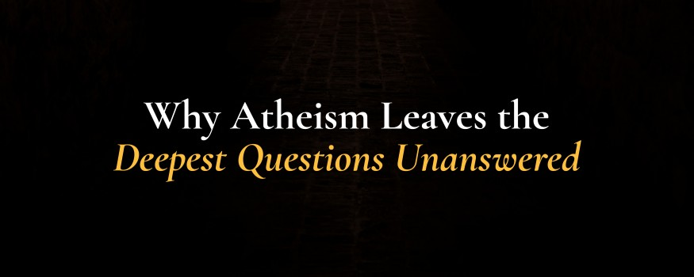

# Why Atheism Leaves the Deepest Questions Unanswered

- **Category:** 
- **Date:** 17/12/2025
- **Author:** 
- **Source:** https://www.quranproject.org/Why-Atheism-Leaves-the-Deepest-Questions-Unanswered-686-d

## Content

For many people today, atheism seems like the rational choice. It feels modern, grounded in science and reason rather than old traditions. But here's the thing: when you really dig into it, atheism struggles to answer the questions that matter most, the ones that actually make us human.
Think about the universe for a second. Science tells us it had a beginning about 14 billion years ago. Everything just burst into existence. But that raises an obvious question: what caused it? We know from basic logic that things don't just pop into existence from nothing. Everything that begins needs a cause. So the universe began, which means something beyond it, something outside space and time, had to bring it into being. Atheism asks us to believe the universe either caused itself (which makes no sense) or came from literal nothingness (which contradicts everything we observe).
And what about how incredibly fine-tuned everything is? The forces that hold atoms together, the strength of gravity, the way chemistry works... all of it is balanced on a knife's edge. If any of these constants were off by even a tiny fraction, life couldn't exist. Stars wouldn't form. Chemistry wouldn't work. Calling this blind luck takes way more faith than believing someone designed it that way.
But here's where it gets really interesting. Atheism completely falls apart when you look at consciousness and morality. How do chemicals and electrical signals create the experience of being you? Why do we feel love, appreciate beauty, or care about justice if we're just sophisticated biological machines? And here's the big one: why does every culture in history agree that certain things are just wrong? Murder. Betrayal. Hurting innocent people. These aren't preferences that randomly vary. They're universal truths that seem hardwired into us.
The Qur'an talks about this. It says every person is born with something called Fitrah, basically an inner compass that recognizes truth and right from wrong. Surah Ar-Rum mentions this natural disposition God placed in all of us. That's why even someone who's never been taught religion still knows instinctively that some things are wrong and that life should mean something.
Atheism also can't offer real hope. If death is just the end, if there's no ultimate justice, if everything we do just disappears into nothing, then why does anything matter? Why help others? Why pursue what's good and true? The questions aren't just philosophical puzzles. They're deeply personal. They're about why you exist and how you should live.
The atheist worldview can describe how things work mechanically, sure. But it can't explain why anything exists at all, why our minds can understand the universe, or why our lives genuinely matter.
Believing in God isn't about checking your brain at the door. Actually, it's about following where reason naturally leads: beyond the physical world to the Source behind it all. The Qur'an constantly encourages people to think, to reflect on creation, to use their intellect. Faith and reason aren't opponents. They're both pointing to the same reality: behind this beautiful, ordered, meaningful universe is a Creator who deserves to be known.