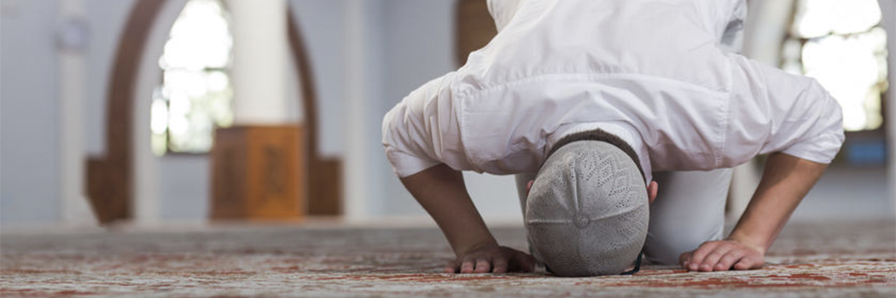

# Why do we Pray?

- **Category:** 
- **Date:** 22/08/2013
- **Author:** 
- **Source:** https://www.quranproject.org/Why-do-we-Pray-505-d

## Content

Every people have their own method of seeking comfort, relaxation and escape. Some use music, some use exercises like Yoga, and others drugs and alcohol.  As for Muslims, we attain the benefits of all of the above and more, from Prayer. We resort to the source of all solutions and the source of all peace and relief - Our Beloved, Our Creator.
Every one of us was created with particular needs; like the need to feel loved, the need to be alone for a while, the need to know that someone special awaits you at home after a long hard day at work, the need to spend time with your children and kiss them to sleep, the need to hear nice words, etc. When these needs go unsatisfied, an imbalance occurs within us that can affect the quality of our entire day. We might become irritable and cranky and not know why. A need within us has not been met that day. Yet we have been created with a need far greater and more critical for our complete well-being than any other…It is the need to worship.
To satisfy this need, people through the ages have worshiped everything under the sun [and including the sun]. They worshiped idols, water, animals, snakes, the sun, the stars and money - exhausting great efforts and wealth to do so. Indeed, this need to worship must be satisfied, but none of the above can satisfy it like worshiping the One True God! And Prayer fulfils that satisfaction.
It was common that when the time for prayer came, the Prophet Muhammad would turn to Bilal [whose duty was to call out the call to prayer] and say,
“Relieve us with it, O Bilal.”
In other words, make the call, Bilal, for what will lighten our heavy burdens and will soothe and comfort us.  For when the Prophet was troubled with a difficult matter or much worry, he would turn to prayer. When the Prophet was facing his toughest time in Makkah, feeling the deepest sadness, how did God console him and lift his spirits? He raised the Prophet to Him during the most momentous event of all time – al-Israa wal-Mi’raaj! [the night journey to Jerusalem and then to the Heaven] till he reached the closest a man can ever reach in nearness to his Lord! It was on this occasion where God obligated the prayer to be performed five times a day.
When we die, Prayer is the first responsibility we will be judged for, if it is sound [accepted], then all our deeds after it will be sound [accepted] and if it is corrupt, then all our deeds after it will be corrupt. The Prophet Muhammad said,
“whoever abandons it [prayer], has disbelieved.”
However, it is not only the Prayer’s obligatory nature that should compel us to tend to it. This would be an incomplete intention. The prayer is an act that brings such a satisfying comfort, a true quenching of that spiritual thirst!  Your body maybe on earth, but your  soul is floating around The Most Merciful’s Throne! Prayer is God’s greatest gift to us.  In it is the peace and true happiness that we all yearn and search for. Every position has a special meaning and a unique significance, so that with every position we move to, we are transported into a new and different scene. These transitions help our minds to stay aware of and internalize the words we utter. These transitions help our hearts to stay alive throughout our Prayer - alive with alternating feelings and emotions before God; those of love, hope, fear, and humility.
Finally remember this: The sweetness of this life lies in remembering Him, the sweetness of the next life lies in seeing Him! when you proceed for prayer, go because you love Him, go because you miss Him and long to be with Him. Feel your heart flutter. Only then, will you be on your way to attaining that inner peace and comfort Prayer was prescribed for.
Edited by A.B. al-Mehri from Mishari al-Karraz, 'Love of Allah: Experience the beauty of Salah'  [download full book http://quranproject.org/SALAT-Book-461-d ]